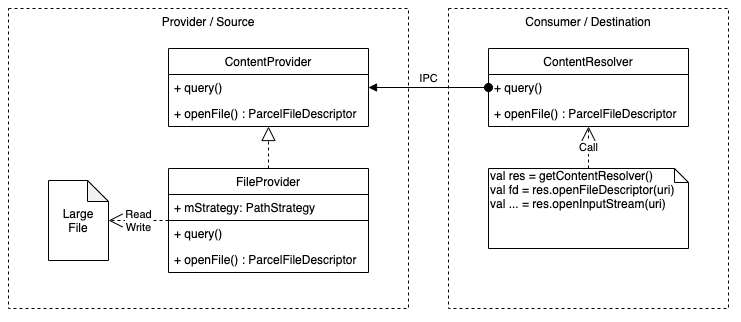
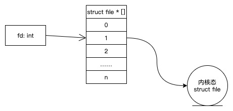
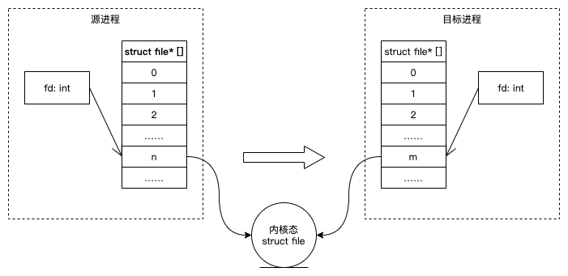

20220427-`FileProvider`学习笔记
---

* [FileProvider的基本面](#fileprovider的基本面)
   * [最小原型](#最小原型)
   * [源应用各项配置的说明](#源应用各项配置的说明)
      * [android:name](#androidname)
      * [android:authorities](#androidauthorities)
      * [android:export](#androidexport)
      * [`<paths/>`](#paths)
   * [怎么实现端对端的uri传递](#怎么实现端对端的uri传递)
      * [uri的默认规则](#uri的默认规则)
      * [通过Intent传递uri](#通过intent传递uri)
      * [通过Intent以外的IPC方式传递uri](#通过intent以外的ipc方式传递uri)
* [FileProvider的展开](#fileprovider的展开)
   * [权限管理](#权限管理)
      * [基本点](#基本点)
      * [授权的有效期](#授权的有效期)
      * [限制可共享文件的范围](#限制可共享文件的范围)
   * [多个FileProvider并存](#多个fileprovider并存)
   * [自定义Uri格式](#自定义uri格式)
* [FileProvider的深入](#fileprovider的深入)
   * [FileProvider文件共享的本质](#fileprovider文件共享的本质)
   * [FD跨进程传输](#fd跨进程传输)
   * [FileProvider以外的FD跨进程传递](#fileprovider以外的fd跨进程传递)
      * [aidl调用](#aidl调用)
      * [FileProvider以外的ContentProvider](#fileprovider以外的contentprovider)
      * [通过Intent调用四大组件](#通过intent调用四大组件)
      * [通过Bundle#putBinder突破Intent和四大组件的限制](#通过bundleputbinder突破intent和四大组件的限制)
      * [通过IPC发送FD的结论](#通过ipc发送fd的结论)

---

本文主要摘要`FileProvider`的关键知识点和记录我的学习思路及验证结论，可以帮助读者比较全面的认识`FileProvider`。如读者尚未了解何为`FileProvider`，请阅读安卓官网的[FileProvider参考](https://developer.android.google.cn/reference/androidx/core/content/FileProvider)和[分享文件指南](https://developer.android.google.cn/training/secure-file-sharing)。

# FileProvider的基本面

## 最小原型

`FileProvider`是特殊的`ContentProvider`，目标是在为保护隐私和数据安全而加强应用沙箱机制的同时，支持在应用间共享文件。关于`ContentProvider`的方方面面，请参考安卓官网的相关[参考](https://developer.android.google.cn/reference/android/content/ContentProvider)和[指南](https://developer.android.google.cn/guide/topics/providers/content-providers)。`FileProvider`共享的客体是单个文件，如果需要共享整个目录，请参考[DocumentsProvider](https://developer.android.google.cn/reference/kotlin/android/provider/DocumentsProvider)。

下图是`FileProvider`的工作模型：



下面假设存在源应用沙箱的`files/some/internal/path/1.dat`文件共享给目标应用，展示双方应用要达成目标的最小代码原型。首先是源应用：

```groovy
// build.gradle
dependencies {
    implementation 'androidx.appcompat:appcompat:+'
}
```

```xml
<!-- AndroidManifest.xml -->
<manifest xmlns:android="http://schemas.android.com/apk/res/android"
          package="com.example.provider">
    <provider android:name="androidx.core.content.FileProvider"
              android:authorities="${applicationId}.fileprovider"
              android:exported="false"
              android:grantUriPermissions="true">
        <meta-data android:name="android.support.FILE_PROVIDER_PATHS"
                   android:resource="@xml/paths"/>
    </provider>
</manifest>
```

```xml
<!-- res/xml/paths.xml -->
<paths xmlns:android="http://schemas.android.com/apk/res/android">
  <files-path name="name-example" path="some/internal/path" />
  <!-- write extra paths rules here -->
</paths>
```

然后是目标应用：

```java
Uri uri = Uri.parse("content://com.example.provider.fileprovider/name-example/1.dat");
InputStream istream = getContentResolver().openInputStream(uri);
// ParcelFileDesciptor fd = getContentResolver().openFileDescriptor(uri, ...);
// read from istream or operate fd
// ...
```

以上就是让`FileProvider`能够成功运行的核心代码（最小原型）。如果要在正式的工程项目中使用`FileProvider`，还需要一些额外代码，但始终都不脱离上述核心代码。下面对一些基础要点展开介绍。

## 源应用各项配置的说明

### `android:name`

如上文所说，`FileProvider`是`ContentProvider`的子类，`AndroidManifest.xml`的配置标签也是`<provider/>`，所以`FileProvider`也属于四大组件。跟所有四大组件一样，`android:name`就是`FileProvider`的实现者类名。

`FileProvider`的`name`默认指定`androidx.core.content.FileProvider`就够了，但这并不是严格要求。某些应用场景会需要提供`androidx.core.content.FileProvider`的子类，关于这个话题将在后面的章节展开介绍。

`androidx.core.content.FileProvider`是`androidx.core:core:+`提供的，可以直接添加`androidx.core:core:+`依赖、或通过`androidx.appcompat:appcompat:+`间接依赖。

### `android:authorities`

参考[\<provider>的指南](https://developer.android.google.cn/guide/topics/manifest/provider-element?hl=en#auth)，`FileProvider`没有特殊要求。

### `android:export`

`FileProvider`要求本字段必须配置`false`，然后针对`uri`授予临时权限。配置`true`会导致编译期报错。本字段的更多说明请参考[\<provider>的指南](https://developer.android.google.cn/guide/topics/manifest/provider-element?hl=en#exported)。关于权限的问题，参考[权限管理](#权限管理)一节。

### `<paths/>`

本配置是`FileProvider`提供的安全策略，可以隐藏沙箱目录的一些具体细节。文件必须位于`<paths/>`标签下配置的目录下，才可以被`FileProvider`共享。

`<paths/>`标签下可以插入多条配置。对`files`目录下的文件需要用`<files-path/>`标签配置策略，如上文的示例代码。`<paths/>`标签下还支持配置缓存目录、外存目录、等其他目录，详细说明请参考[FileProvider参考](https://developer.android.google.cn/reference/androidx/core/content/FileProvider)。

`<paths/>`的配置会影响文件的`uri`，如上文示例代码那样。详细说明参考后续章节[uri的默认规则](#uri的默认规则)。

## 怎么实现端对端的uri传递

`ContentProvider`的`uri`通常由源应用定义。除非源应用和目标应用有过事先约定，否则目标应用是很难自己生成正确`uri`的。`FileProvider`封装的`PathStrategy`，并基于`PathStrategy`提供了一套生成`uri`的规则。

### uri的默认规则

在源应用中，`uri`需要通过`FileProvider.getUriFromFile(..., file)`获取，方法内部会遍历`PathStrategy`的所有策略，根据匹配的策略把文件路径映射为`uri`。相对的，在目标应用调用`FileProvider`读写文件的时候，`FileProvider`会根据相同的`PathStrategy`反向把`uri`映射为文件路径。

在上文的示例代码中，文件路径`files/some/internal/path/1.dat`命中了规则`<files-path name="name-example" path="some/internal/path" />`，其中`files`对应`<files-path/>`、`some/internal/path`对应`path="..."`。`FileProvider`会把`files/some/internal/path`部分替换为`name="..."`的值，加上`FileProvider`的`authority`，就得到了`content://com.example.provider.fileprovider/name-example/1.dat`。

类似的，如果上文示例代码存在如下配置：

```xml
<!-- res/xml/paths.xml -->
<paths xmlns:android="http://schemas.android.com/apk/res/android">
  <files-path name="name-example" path="some/internal/path" />
  <files-path name="another-example" path="another/internal/path" />
</paths>
```

假设要共享的文件为`files/another/internal/path/some/image/2.png`，则映射`uri`的结果是`content://com.example.provider.fileprovider/another-example/some/image/2.png`。

基于`FileProvider`的映射规则，只要①`FileProvider`事先完成了对`uri`的授权，且②目标应用预先知道了某个文件的相对路径，那么从技术上来说，目标应用可以不需要源应用告诉，就能自己根据源应用的`<paths/>`配置生成正确的`uri`。在实际项目中仍然需要应用间通过IPC途径传递`uri`，正是因为上述①②两点很难满足、且不应轻易满足。

### 通过Intent传递uri

`Intent`是常用的进程间通信载体。通过`Intent`传递`uri`的最小原型如下：

```java
Uri uri = ...;
Intent intent = new Intent();
intent.setData(uri);
intent.setFlags(Intent.FLAG_GRANT_READ_URI_PERMISSION);
// send the intent
```

1. `uri`一定要通过`setData`（在`APILEVEL ∈ [16, 22]`的设备上需要使用[setClipData()方法](https://developer.android.google.cn/reference/androidx/core/content/FileProvider)）设置；
2. 一定要通过`setFlags`设置`uri`的读写权限；

如果上述两点没有满足，目标应用在使用`uri`的时候会得到一个`java.lang.SecurityException: Permission Denial`异常。

上面的`Intent`可以通过多种方式发送到目标应用：

1. `Context.startActivity(intent)`：如调用另一个应用打开沙箱内的一个文档；
2. `Activity.setResult(intent)`：如调用一个文件选择器返回一个文档；
3. `Context.startService(intent)`；
4. Android定义的其他其他`Intent`发送的手段；

上述方案除了`uri`授权的有效期略有不同以外，本质上是一样的，可依据具体应用场景选用。关于`uri`授权有效期的问题，会在[权限管理](#权限管理)一节介绍。

### 通过Intent以外的IPC方式传递uri

典型的方法是Binder。例如定义如下aidl：

```java
interface IDocumentRepositoty {
    Uri requestDocument(String myPackageName, String documentName);
}
```

关于Binder和aidl的使用方法，可参考[Android 接口定义语言 (AIDL)](https://developer.android.google.cn/guide/components/aidl)，本文不做展开。

在源应用返回`uri`之前，一定要通过`Context.grantUriPermissions()`方法设置`uri`的读写权限，否则目标应用在使用`uri`时会得到一个`java.lang.SecurityException: Permission Denial`异常。

```java
public class RepositoryImpl implements IDocumentRepositoty.Stub {
    Context context = ...;
    
	public Uri requestDocument(String toPackageName, String documentName) {
        Uri uri = ...;
        context.grantUriPermissions(toPackageName, uri, Intent.FLAG_GRANT_READ_URI_PERMISSION);
        return uri;
    }
}
```

[权限管理](#权限管理)一节会对`Context.grantUriPermissions()`做更多介绍。

# FileProvider的展开

## 权限管理

### 基本点

权限管理的目标是控制所有`uri`的读写权限，权限可以是只读、只写、可读可写。所有`uri`在通过授权之前，默认是不能被读写的，否则会收到`java.lang.SecurityException: Permission Denial`异常。对只读`uri`做写操作、或对只写`uri`做读操作，都会收到异常。

授权的粒度是`uri×目标应用包名`。对相同目标应用，不同的`uri`要分别授权；对相同的`uri`、不同的目标应用也要分别授权。基于这样的粒度，所以不用担心预期之外的应用强行读写`uri`，也不用担心授权的目标应用随意生成`uri`枚举源应用内的文件。

在通过`Intent`传递`uri`的时候，如果通过`Intent.setFlags()`设置了读或写权限，那么有且只有收到`Intent`的应用能获得授权。收到`Intent`后，该应用的所有代码都能获得授权，跟收到`Intent`的是`Activity`、`Service`、或其他组件无关。

如果没有通过`Intent.setFlags()`授权，则需要通过`Context.grantUriPermissions(toPackage, uri, flags)`授权，其中参数`toPackage`是目标应用的包名。

### 授权的有效期

`uri`的授权都是临时授权。根据授权方式不同，授权的有效期和过期规则略有差异。一旦授权过期或取消了，就需要源应用重新授权。

通过`Intent.setFlags()`授权，根据接收`Intent`的组件不同，授权有效期的判断依据有差异：

- 如果`Intent`接收组件为`Activity`，则其所在栈的所有`Activity`执行`onDestroy`之后，授权就过期了；
- 如果`Intent`的接收组件为`Service`，则该`Service`执行`onDestroy`之后，授权就过期了；

通过`Context.grantUriPermissions(toPackage, ...)`授权，当`toPackage`指向的应用的所有进程都结束后，授权就过期了。

除了上述由Android管理的过期策略，应用还可以调用`Context.revokeUriPermission(uri, ...)`主动收回授权。

### 限制可共享文件的范围

通过`FileProvider`共享的文件，都必须位于`<paths/>`配置包含的目录下；分享一个不在这些目录下的文件会在调用`getUriFromFile`的时候收到一个异常。为叙述方便，下文将这些符合`<paths/>`配置的文件简称为“paths集合”。

在上文最小原型示例中，`FileProvider`的`android:grantUriPermissions`字段配置为`true`，其效果是所有属于paths集合的文件都可以共享。如果`android:grantUriPermissions`配置为`false`，则需要配置`<grant-uri-permission/>`定义一个子集（下文简称为“grant集合”）。paths集合和grant集合的交集才是可以共享的文件集合。更多说明请参考官网指南：[android:grantUriPermissions](https://developer.android.google.cn/guide/topics/manifest/provider-element?hl=en#gprmsn)和[\<grant-uri-permission/>](https://developer.android.google.cn/guide/topics/manifest/grant-uri-permission-element)。

## 多个FileProvider并存

Android允许定义多个`FileProvider`，应用构建的时候AGP似乎并不会校验这些`FileProvider`配置是否有重复或冲突，但是在运行时可能会得到预期之外的结果。

这里列出一些典型的情况（假设配置了两个`FileProvider`，且两者的`<paths/>`配置不同）：

1. 如果`android:name`相同、`android:authorities`也相同：只有写在前面的`FileProvider`是有效的，后面的`FileProvider`的`<paths/>`配置对`getUriForFile()`不可见；源应用调用`getUriForFile()`获取第二个`FileProvider`的`uri`的时候，会得到`java.lang.IllegalArgumentException: Failed to find configured root`异常。
2. 如果`android:name`相同、`android:authorities`不同：源应用在调用`getUriForFile()`的时候能得到正确的`uri`；目标应用通过`uri`访问文件的时候，只能解析写在前面的`FileProvider`的`uri`，解析后面的`FileProvider`的`uri`时会得到`java.lang.SecurityException: The authority does not match`异常。
3. 如果`android:name`不同（如继承自`FileProvider`的子类）、`android:authorities`相同：源应用会得到跟第一种情况相同的结果。
4. 如果`android:name`不同、`android:authorities`也不同：源应用调用`getUriForFile()`时传入正确的`authority`就能得到正确的`uri`；目标应用也可以成功的访问`uri`指向的文件。

基于上面的情况，项目中每个模块在提供`FileProvider`的时候，比较好的做法是：

1. `android:name`用从`FileProvider`继承的子类类名；
2. `android:authorities`使用不容易跟别人重复的值；

## 自定义Uri格式

`FileProvider`可以被继承，Android允许子类重载`FileProvider`的默认行为。这里介绍如何通过重载`FileProvider`来自定义`uri`格式。

下面演示如何把形如`content://${authority}/${name}/${relativePath}`的`uri`按照`content://${authority}/${md5FromFilePath}`的格式加密，如`content://com.example.fileprovider/c2681e80365f7f9f041875cbd25e4c20`。如果源应用想对目标应用完全隐藏其文件在沙箱中的路径信息，可以考虑类似方案。

首先继承`FileProvider`并重载所有`openFile()`：

```java
public class MyFileProvider extends FileProvider {

    static Map<Uri, Uri> mappedUris = new ConcurrentHashMap<>(); // alternative to original

    public static Uri getUriForFile(@NonNull Context context, @NonNull String authority, @NonNull File file) {
        Uri original = FileProvider.getUriForFile(context, authority, file);
        String md5 = getMD5(original.getPath());
        Uri alternative = Uri.parse(original.getScheme() + "://" + original.getAuthority() + "/" + md5);
        synchronized (mappedUris) {
            for (Entry<Uri, Uri> entry : mappedUris.entrySet()) {
                if (entry.getValue().equals(original)) {
                    return entry.getKey();
                }
            }
            mappedUris.put(alternative, original);
        }
        return alternative;
    }

    @Override
    public ParcelFileDescriptor openFile(@NonNull Uri uri, @NonNull String mode) throws FileNotFoundException {
        Uri originalUri = mappedUris.get(uri);
        if (originalUri == null) {
            throw new FileNotFoundException();
        }
        return super.openFile(originalUri, mode);
    }
    
    //...
}
```

然后使用加密后的`uri`：

```java
// Uri normalUri = FileProvider.getUriForFile(context, authority, sourceFile);
Uri hashedUri = MyFileProvider.getUriForFile(context, authority, sourceFile);
intent.setData(hashedUri); // 因为重载了openFile()，所以传递normalUri会让目标应用收到一个FileNotFoundException
```

目标应用不需要做任何修改。

# FileProvider的深入

## FileProvider文件共享的本质

假设目标应用通过[`ContentResolver#openInputStream()`方法](http://aospxref.com/android-10.0.0_r47/xref/frameworks/base/core/java/android/content/ContentResolver.java#1168)访问文件：

```java
public final @Nullable InputStream openInputStream(@NonNull Uri uri) throws FileNotFoundException {
    String scheme = uri.getScheme();
    if (SCHEME_ANDROID_RESOURCE.equals(scheme)) {
        //...
    } else if (SCHEME_FILE.equals(scheme)) {
        //...
    } else {
        AssetFileDescriptor fd = openAssetFileDescriptor(uri, "r", null);
        //...
    }
}
```

跟随如上代码继续阅读，最终能调用到[`ContentProvider#openTypedAssetFile()`方法](http://aospxref.com/android-10.0.0_r47/xref/frameworks/base/core/java/android/content/ContentProvider.java#1890)：

```java
public @Nullable AssetFileDescriptor openTypedAssetFile(@NonNull Uri uri, @NonNull String mimeTypeFilter, @Nullable Bundle opts) throws FileNotFoundException {
    //...
    return openAssetFile(uri, "r");
    //...
}
```

[`ContentProvider#openAssetFile()`方法](http://aospxref.com/android-10.0.0_r47/xref/frameworks/base/core/java/android/content/ContentProvider.java#1710)：

```java
1710      public @Nullable AssetFileDescriptor openAssetFile(@NonNull Uri uri, @NonNull String mode)
1711              throws FileNotFoundException {
1712          ParcelFileDescriptor fd = openFile(uri, mode);
1713          return fd != null ? new AssetFileDescriptor(fd, 0, -1) : null;
1714      }
```

`FileProvider#openFile()`方法：

```java
public ParcelFileDescriptor openFile(@NonNull Uri uri, @NonNull String mode) throws FileNotFoundException {
    // ContentProvider has already checked granted permissions
    final File file = mStrategy.getFileForUri(uri);
    final int fileMode = modeToMode(mode);
    return ParcelFileDescriptor.open(file, fileMode);
}
```

最终收敛到`ParcelFileDescriptor.open(file, fileMode)`方法上。目标应用通过其他接口访问文件最终基本都收敛到此方法上。

根据上述分析，可以得到以下结论：

1. 文件共享的本质不是跨进程传输文件字节流，而是跨进程传输FD；
2. FD可以通过binder传输，且保障了FD跨进程可用；

## FD跨进程传输

Linux的FD跟Windows的Handle本质上类似，都是对进程中一个指针数组的索引，这个指针数组的每个元素分别指向了一个内核态数据。



每个进程都有自己的指针数组，不同进程的指针数据一个各不相同，所以FD的值只有在进程内有意义，另一个进程的相同FD取值可能指向的完全是另一个对象，或根本没有指向任何对象（野指针或空指针）。所以直接跨进程传送FD的值是没有意义的。

可以推测binder可能对FD做了特殊处理。这一推测可以从`binder.c`的`binder_transaction`函数中（[源码](http://androidxref.com/kernel_3.18/xref/drivers/staging/android/binder.c#1633)）找到证据：

```c++
static void binder_transaction(struct binder_proc *proc, struct binder_thread *thread, struct binder_transaction_data *tr, int reply) {
    //...
    switch (fp->type) {
            //...
        case BINDER_TYPE_FD: {
            int target_fd;
            struct file *file;
            //...
            file = fget(fp->handle); // 1. 用源进程的FD获得file*
            //...
            security_binder_transfer_file(proc->tsk, target_proc->tsk, file);
            //...
            target_fd = task_get_unused_fd_flags(target_proc, O_CLOEXEC); // 2. 在目标进程分配新的FD
            //...
            task_fd_install(target_proc, target_fd, file); // 3. 把file*赋值给新FD
            //...
            fp->handle = target_fd; // 4. 把新FD发给目标进程
        } break;
            //...
    }
    //...
}
```

binder通过上面代码中的4个关键步骤，在目标进程分配新的FD并让其指向内核的`file`对象。FD的跨进程传递的本质是`file`对象指针的跨进程传递。



关于上述步骤的相关源码可参考：

1. [fget](http://androidxref.com/kernel_3.18/xref/fs/file.c#650) → [__fget](http://androidxref.com/kernel_3.18/xref/fs/file.c#__fget) → [fcheck_files参考](https://www.cnblogs.com/lit10050528/p/6206235.html) 
2. [task_get_unused_fd_flags](http://androidxref.com/kernel_3.18/xref/drivers/staging/android/binder.c#task_get_unused_fd_flags) → [__alloc_fd](http://androidxref.com/kernel_3.18/xref/fs/file.c#445) → [__set_open_fd](http://androidxref.com/kernel_3.18/xref/fs/file.c#__set_open_fd) 
3. [task_fd_install](http://androidxref.com/kernel_3.18/xref/drivers/staging/android/binder.c#task_fd_install) → [__fd_install](http://androidxref.com/kernel_3.18/xref/fs/file.c#552) 

上述源码中还调用了`security_binder_transfer_file`函数，本质上是对[`selinux_binder_transfer_file`函数](http://androidxref.com/kernel_3.18/xref/security/selinux/hooks.c#1961)的调用。该函数负责校验进程双方是否具有传递此FD的权限，更多介绍可参考[罗升阳的《SEAndroid安全机制对Binder IPC的保护分析》](https://blog.csdn.net/Luoshengyang/article/details/38326729)，这里不做展开。

## FileProvider以外的FD跨进程传递

既然FD是通过binder保障了跨进程传递，那么`FileProvider`就不是文件共享的唯一途径，其他基于binder的IPC方法应该也可以传递FD，例如：

1. 通过`Intent`调用四大组件，如`Activity`、`Service`、`BroadcastReceiver`；
2. 通过`FileProvider`以外的`ContentProvider`；
3. 通过`aidl`调用；

### aidl调用

例如有如下`aidl`：

```java
interface ISampleAidl {
    void sendFile(in ParcelFileDescriptor fd);
    ParcelFileDescriptor recvFile();
}
```

通过入参可以从主调进程把FD传递给被调进程；通过返回值可以从被调进程把FD传递给主调进程。除了直接在入参和返回值使用`ParcelFileDescriptor`，还可以通过其他`Parcelable`类型（如`Bundle`等）携带FD。

### FileProvider以外的ContentProvider

例如在源应用做如下自定义Provider：

```java
public class MyContentProvider extends ContentProvider {
    @Nullable
    @Override
    public ParcelFileDescriptor openFile(@NonNull Uri uri, @NonNull String mode) throws FileNotFoundException {
        File file = ...;
        return ParcelFileDescriptor.open(file, ParcelFileDescriptor.MODE_READ_ONLY);
    }
}
```

在目标应用有类似如下调用：

```java
Uri uri = ...;
try (ParcelFileDescriptor fd = getContentResolver().openFileDescriptor(uri, "r")) {
    readFromFD(fd);
} catch (IOException e) {
    e.printStackTrace();
}
```

本质上`FileProvider`就是基于此模型而封装的库。

### 通过`Intent`调用四大组件

调用四大组件的方法有但不限于以下方法：

1. `Context#startActivity(Intent)`
2. `Context#startService(Intent)`
3. `Context#sendBroadcast(Intent)`

例如通过如下方法携带FD：

```java
ParcelFileDescriptor fd = ...;
Intent intent = new Intent();
//...
intent.putExtra("file", fd);
startActivity(intent); // RuntimeException: Not allowed to write file descriptors here
```

意外的是，调用`startActivity`的时候发生了异常：

```
java.lang.RuntimeException: Not allowed to write file descriptors here
    at android.os.Parcel.nativeWriteFileDescriptor(Native Method)
    at android.os.Parcel.writeFileDescriptor(Parcel.java:809)
    at android.os.ParcelFileDescriptor.writeToParcel(ParcelFileDescriptor.java:1057)
    at android.os.Parcel.writeParcelable(Parcel.java:1801)
    at android.os.Parcel.writeValue(Parcel.java:1707)
    at android.os.Parcel.writeArrayMapInternal(Parcel.java:928)
    at android.os.BaseBundle.writeToParcelInner(BaseBundle.java:1584)
    at android.os.Bundle.writeToParcel(Bundle.java:1253)
    at android.os.Parcel.writeBundle(Parcel.java:997)
    at android.content.Intent.writeToParcel(Intent.java:10495)
    at android.app.IActivityManager$Stub$Proxy.startService(IActivityManager.java:5153)
    at android.app.ContextImpl.startServiceCommon(ContextImpl.java:1601)
    at android.app.ContextImpl.startService(ContextImpl.java:1571)
    at android.content.ContextWrapper.startService(ContextWrapper.java:669)
    at android.content.ContextWrapper.startService(ContextWrapper.java:669)
```

看起来并不是binder不允许传递FD。下面分析相关源码，尝试寻找原因和突破点。先从抛出异常的代码开始。

```c++
/* http://aospxref.com/android-10.0.0_r47/xref/frameworks/base/core/jni/android_util_Binder.cpp#814 */
void signalExceptionForError(JNIEnv* env, jobject obj, status_t err, bool canThrowRemoteException, int parcelSize) {
    switch (err) {
            //...
        case FDS_NOT_ALLOWED:
            jniThrowException(env, "java/lang/RuntimeException", "Not allowed to write file descriptors here");
            break;
            //...
    }
}
```

```c++
/* http://aospxref.com/android-10.0.0_r47/xref/frameworks/native/libs/binder/Parcel.cpp#553 */
status_t Parcel::appendFrom(const Parcel *parcel, size_t offset, size_t len) {
    //...
    if (!mAllowFds) {
        err = FDS_NOT_ALLOWED;
    }
    //...
    return err;
}
```

看得出跟属性`mAllowFds`的设置有关。设置`mAllowFds`的代码在：

```c++
/* http://aospxref.com/android-10.0.0_r47/xref/frameworks/native/libs/binder/Parcel.cpp#575 */
bool Parcel::pushAllowFds(bool allowFds) {
    const bool origValue = mAllowFds;
    if (!allowFds) {
        mAllowFds = false;
    }
    return origValue;
}
```

```java
/* http://aospxref.com/android-10.0.0_r47/xref/frameworks/base/core/java/android/os/Bundle.java#1250 */
public void writeToParcel(Parcel parcel, int flags) {
    final boolean oldAllowFds = parcel.pushAllowFds((mFlags & FLAG_ALLOW_FDS) != 0);
    try {
        super.writeToParcelInner(parcel, flags);
    } finally {
        parcel.restoreAllowFds(oldAllowFds);
    }
}
```

跟踪标志位`FLAG_ALLOW_FDS`的设置：

```java
/* http://aospxref.com/android-10.0.0_r47/xref/frameworks/base/core/java/android/os/Bundle.java#204 */
public boolean setAllowFds(boolean allowFds) {
    final boolean orig = (mFlags & FLAG_ALLOW_FDS) != 0;
    if (allowFds) {
        mFlags |= FLAG_ALLOW_FDS;
    } else {
        mFlags &= ~FLAG_ALLOW_FDS;
    }
    return orig;
}
```

`Bundle#setAllowFds(false)`在多处代码有调用，如：[`Intent#prepareToLeaveProcess`](http://aospxref.com/android-10.0.0_r47/xref/frameworks/base/core/java/android/content/Intent.java#10752)、[`LoadedApk$ReceiverDispatcher#performReceive`](http://aospxref.com/android-10.0.0_r47/xref/frameworks/base/core/java/android/app/LoadedApk.java#1447)、[`BroadcastReceiver$PendingResult#sendFinished`](http://aospxref.com/android-10.0.0_r47/xref/frameworks/base/core/java/android/content/BroadcastReceiver.java#260)、等，其中`Intent#prepareToLeaveProcess`被[`Instrumentation#execStartActivity`](http://aospxref.com/android-10.0.0_r47/xref/frameworks/base/core/java/android/app/Instrumentation.java#1671)调用。

上面涉及的代码都属于非公开接口，应用程序不应该调用。由此可知Android不希望在四大组件调用过程中传递FD，故意设置了门槛。

### 通过`Bundle#putBinder`突破`Intent`和四大组件的限制

已知通过`aidl`可以传递FD，且`Bundle`类有`putBinder`方法可以传递`IBinder`，那么不妨发一个`IBinder`到目标进程，然后用这个`IBinder`传递FD。虽然本质上还是`aidl`的调用，但可以不用依赖`bindService`等方法建立连接，而是通过`Intent`直接发到目标进程。

首先定义`aidl`：

```java
interface IFileBinder {
    ParcelFileDescriptor openFileDescriptor(int mode);
}
```

实现`IFileBinder`：

```java
public class FileBinder extends IFileBinder.Stub {
    final File mFile;

    public FileBinder(File file) {
        mFile = file;
    }

    @Override
    public ParcelFileDescriptor openFileDescriptor(int mode) throws RemoteException {
        try {
            return ParcelFileDescriptor.open(mFile, mode);
        } catch (FileNotFoundException e) {
            throw new RemoteException(e.getMessage());
        }
    }
}
```

发送FD：

```java
File file = ...;
Bundle bundle = new Bundle();
bundle.putBinder("file", new FileBinder(file).asBinder());
Intent intent = new Intent(/*...*/);
intent.putExtras(bundle);
startActivity(intent);
```

接收FD：

```java
Bundle bundle = intent.getExtras();
IBinder binder = bundle.getBinder("file");
IFileBinder fileBinder = IFileBinder.Stub.asInterface(binder);
ParcelFileDescriptor fd = fileBinder.openFileDescriptor(ParcelFileDescriptor.MODE_READ_ONLY);
//...
```


### 通过IPC发送FD的结论

上面例举了若干跨进程传递FD的方法，相互各有优劣。如要从上述各方法中做选择，可以至少从以下几点来考虑：

1. 源应用是否需要定制；
2. 目标应用是否需要定制；
3. 目标应用是否需要对FD做细粒度的控制；
4. 源应用是否需要对目标应用做权限校验和控制；
5. 代码的易维护性和易扩展性；

综合来说，`FileProvider`在各方面都是比较完备和可靠的文件共享机制。

