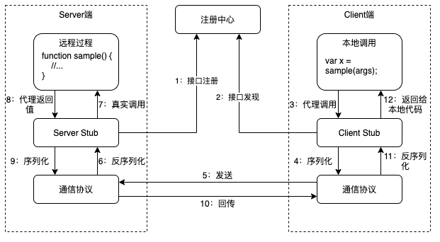

马上观RPC
---

* [常用的IPC机制](#常用的ipc机制)
* [RPC的结构](#rpc的结构)
   * [RPC的通信协议](#rpc的通信协议)
   * [过程调用和Stub](#过程调用和stub)
   * [接口定义和IDL](#接口定义和idl)
   * [接口注册和发现](#接口注册和发现)
   * [使用RPC的基本步骤](#使用rpc的基本步骤)
* [Android基于Binder提供的IPC机制](#android基于binder提供的ipc机制)
* [Windows提供的RPC机制](#windows提供的rpc机制)
* [一些开源RPC库](#一些开源rpc库)

---

RPC是Remote Procedure Call的缩写，即远程过程调用。RPC是一系列技术的统称，通过这些技术，可以让应用程序像调用本地服务一样调用远程服务。与RPC类似的概念还有IPC和LPC。IPC即Inter-Process Comunication（进程间通信），LPC即Local Procedure Call（本地过程调用）。这些概念在传播中不免有交叉混用的情况。

本文不是对RPC等术语做严格定义，不会对相关技术做深入的分析。本文更像一个对RPC相关知识的不完全概括，和对RPC部分相关技术的简介。本文是近期对RPC快餐式学习的总结。

# 常用的IPC机制

IPC是指进程间通信，包含一系列技术。虽然RPC也可以算是进程间通信，但IPC更多是说基于操作系统内核提供的一些机制，让运行在同一个设备上的不同进程之间交换数据的一系列技术的统称。

大家提到IPC的时候，主要指代以基本数据和信号传输为主的通用通信机制。在应用程序中IPC基本处于底层数据通道的地位。不同操作系统提供的IPC机制略有不同。下面对基础的IPC机制做个不完全的列举。

**Linux：**

- 管道（Pipe）：匿名管道和命名管道；
- 信号量（Semophore）；
- 信号（Signal）；
- 内存映射（mmap）；
- 套接字（Socket）；

**Windows：**

- 管道，同Linux；
- 邮槽（Mail Slot）；
- 动态数据交换（DDE）；
- 文件映射（File Mapping）；
- 窗口事件；
  - 特殊的事件`WM_COPYDATA`：系统内核会负责跨进程内存拷贝；
- 剪贴板；
- DLL共享内存段；
- 套接字（Socket）；

**Android（以JVM可用的为主）：**

- 共享内存/内存映射（`MemoryFile`/`mmap`）；
- 基于binder驱动的若干机制：
  - `Intent`和四大组件；
  - `Binder`和`aidl`；
  - 基于File Descriptor的文件共享；

# RPC的结构

RPC即远程过程调用。虽然在同一个设备上运行的不同进程间的调用也时不时被称作RPC，但RPC更多的是以跨设备调用为默认语境，即所谓的“远程”。话又说回来，有的RPC机制支持以系统内的IPC机制为底层通信协议实现设备内的高效调用，所以把同设备内的调用说成RPC也不算全错。

除了“远程”以外，“调用”的外观也是RPC的一个特性。所谓调用，是指程序可以像调用本地代码一样调用位于其他进程或设备上的代码。RPC不只是单纯的数据通信通道，而是在通信通道之上建立一套体系，把数据通信的过程对开发者隐藏起来。

下图是RPC的基本结构：



## RPC的通信协议

所有RPC都是基于一套或多套通信协议作为远程通信通道。有的RPC机制只支持特定协议，甚至对特定协议有较强耦合；有的则可以支持在多个协议中任意选择搭配，其中也有以操作系统的IPC为协议，实现系统内进程间调用的例子。

不同RPC可能会选择不同的协议。例如：TCP、UDP、HTTP、protobuf、mqtt、等，甚至私有协议。RPC可能会基于下面的考虑选择协议：
1. 网络连接的维持和QoS；
2. 数据传输的安全性；
3. 数据传输的体积和效率；
4. 设备和网络环境对协议的兼容性和限制；
5. 协议对自定义数据结构的易扩展性；
6. 等等。

## 过程调用和Stub

通信协议只负责无差别二进制数据的传输，而RPC要过程调用的界面，协议和调用界面的差距，就是由Stub（存根）来填补的。

以一次调用过程为例，结合上面的架构图，介绍Stub的职责（这里先省略接口注册环节）：
1. Client本地代码调用被Client Stub代理的`sample`过程，代理的`sample`过程跟远程代码具有相同的函数原型；
2. Client Stub把函数调用翻译成特定格式的二进制流，其中包含函数标识和序列化的所有入参；
3. Client Stub把二进制流通过通信协议发送到Server端；
4. Server Stub从通信协议接收二进制流，从中解析出目标函数标识，并反序列化所有入参；
5. Server Stub根据上一步解析的数据，调用目标`sample`过程；
6. Server Stub把本地`sample`过程的返回数据按照跟上面步骤相反的过程，回传给Client Stub；
7. Client Stub把收到的返回值返回给本地调用代码。

通过上述步骤，Stub对上层代码隐藏了远程调用和本地调用的差异。

## 接口定义和IDL

上一节介绍了Stub代理调用和隐藏细节的作用。在RPC中Stub代码通常不用人工实现，而是使用一些工具自动生成。Stub代码生成工具通常以IDL文件作为输入。

IDL即中间描述语言，是一系列与具体编程语言无严格关系的语言。IDL的作用是描述远程接口，其中包含接口的原型，以及生成Stub代码所需的其他信息。IDL和代码生成工具通常由RPC框架定义和提供。

下面是Microsoft RPC的MIDL示例：

```idl
[ 
    uuid (ba209999-0c6c-11d2-97cf-00c04f8eea45), 
    version(1.0)
] 
interface math
{
	int Add([in] int x, [in] int y);
}
```

下面Android AIDL的示例：

```java
package com.example;

interface ISampleAidl {
    void sendFile(in ParcelFileDescriptor fd);
}
```


## 接口注册和发现

在过程调用之前，需要Client端跟Server端建立某种连接，以确保端到端的数据通道。建立连接需要一个接口注册中心提供Server的位置（如IP地址、域名、等）和监听信息（如端口等），这些信息通过Server端的接口注册提供。

担任接口注册中心的，可能是一台服务器，也可能是Server端的某个进程。不同RPC框架可能会做出不同的设计。

## 使用RPC的基本步骤

使用RPC一般会包含下面的步骤：
1. 用IDL定义接口及相关信息；
2. 使用IDL工具生成Stub代码；
3. Server端实现接口；
4. Server端向注册中心注册接口和监听信息；
5. Client端发现和连接Server；
6. Client端调用Client Stub；

有的RPC框架可能会省略或自动完成部分步骤。

# Android基于Binder提供的IPC机制

Android通过AIDL定义接口，例如：
```java
// IFileBinder.aidl
interface IFileBinder {
    ParcelFileDescriptor openFileDescriptor(int mode);
}
```

android-gradle-plugin会在编译时生成Stub代码。Android从Stub中细分出了Stub/Proxy结构，其中Server端实现接口的时候需要继承自`Stub`类，而Proxy本质是Client Stub，供Client端代码调用。
```java
// IFileBinder.java（已省略大量代码，只保留了关键代码）
public interface IFileBinder extends android.os.IInterface {
    /** Local-side IPC implementation stub class. */
    public static abstract class Stub extends android.os.Binder implements IFileBinder {
        public static phantom.demo.fileprovider.common.IFileBinder asInterface(android.os.IBinder obj) {
            //...
            return new IFileBinder.Stub.Proxy(obj);
        }
        private static class Proxy implements IFileBinder {
            //...
        }
    }
}
```

```java
// Server端的接口实现
public class FileBinder extends IFileBinder.Stub {
	//...
}
```

```java
// Client端调用
IBinder binder = ...;
int mode = ...;
IFileBinder fileBinder = IFileBinder.Stub.asInterface(binder); // 返回的是Proxy
ParcelFileDescriptor fd = fileBinder.openFileDescriptor(mode);
```

Android提供了一个binder驱动作为系统内大量IPC的基础。在framework中继续binder驱动封装了`Binder`类，相当于Stub代码的通信协议。

```java
// Server端（已省略大量代码，只保留了关键代码）
public static abstract class Stub extends android.os.Binder implements IFileBinder {
    @Override public boolean onTransact(int code, android.os.Parcel data, android.os.Parcel reply, int flags) throws android.os.RemoteException {
        _arg0 = data.readInt();
        android.os.ParcelFileDescriptor _result = this.openFileDescriptor(_arg0);
        _result.writeToParcel(reply, android.os.Parcelable.PARCELABLE_WRITE_RETURN_VALUE);
        return true;
    }
}
```

```java
// Client端（已省略大量代码，只保留了关键代码）
private static class Proxy implements IFileBinder {
    @Override public ParcelFileDescriptor openFileDescriptor(int mode) throws RemoteException {
        mRemote.transact(Stub.TRANSACTION_openFileDescriptor, _data, _reply, 0);
        _result = android.os.ParcelFileDescriptor.CREATOR.createFromParcel(_reply);
        return _result;
    }
}
```

Android基于binder驱动实现了一个系统服务ServiceManager。ServiceManager就是注册中心，通过名称注册和发现接口。关于ServiceManager这里不做更多展开。

Android通过`Stub`类和`Binder`类自动完成了接口注册和接口发现，并通过相关系统接口自动完成了从Client端到Server端的连接。关于Binder机制的细节这里不做更多展开。

```java
public static abstract class Stub extends android.os.Binder implements IFileBinder {
    private static final java.lang.String DESCRIPTOR = "com.example.IFileBinder";
    /** Construct the stub at attach it to the interface. */
    public Stub() {
        this.attachInterface(this, DESCRIPTOR);
    }
}
```

关于AIDL使用方面的详细介绍，可以参考官方文档[Android 接口定义语言 (AIDL)](https://developer.android.google.cn/guide/components/aidl)。

# Windows提供的RPC机制

Microsoft RPC使用MIDL来定义接口，接口文件以`.idl`为扩展名。开发者可以用`uuidgen`工具生成接口的UUID并生成`.idl`文件模板。

```bash
uuidgen -i -oMyApp.idl
```

`.idl`文件如下：

```idl
[
  uuid(ba209999-0c6c-11d2-97cf-00c04f8eea45),
  version(1.0)
]
interface INTERFACENAME
{
}
```

开发者需要把`INTERFACENAME`替换为接口的实际名称，并添加接口方法。

使用`midl`命令行工具编译`.idl`文件可以得到Stub代码：

```bash
midl MyApp.idl
```

Stub代码是C程序文件，包含接口头文件`MyApp.h`、Server Stub实现`MyApp_s.c`、和Client Stub实现`MyApp_c.c`。

`MyApp.h`和`MyApp_s.c`需要参与Server端程序的编译和链接，Server端代码按照`MyApp.h`的声明实现接口。`MyApp.h`和`MyApp_c.c`需要参与Client端程序的编译和连接，Client端代码按照`MyApp.h`的声明调用接口。

Microsoft RPC的注册中心叫终结点映射（endpoint map），它运行在Server主机中。

Server端需要通过如下步骤完成接口注册（下面是关键代码示例）：

```c++
RPC_STATUS status;
// 1. 注册接口
status = RpcServerRegisterIf(MyInterface_v1_0_s_ifspec, NULL, NULL);
// 2. 绑定协议
status = RpcServerUseAllProtseq(L"ncacn_ip_tcp", RPC_C_PROTSEQ_MAX_REQS_DEFAULT, NULL);
RPC_BINDING_VECTOR *rpcBindingVector;
status = RpcServerInqBindings(&rpcBindingVector);
// 3. 注册endpoint
status = RpcEpRegister(MyInterface_v1_0_s_ifspec, rpcBindingVector, NULL, NULL);
// 4. 开始监听Client请求
status = RpcServerListen(1, RPC_C_LISTEN_MAX_CALLS_DEFAULT, 0);
```

Client端需要通过如下步骤完成接口发现和建立连接（下面是关键代码示例）：

```c++
RPC_STATUS status;
// 1. 指定通信协议和Server端域名
unsigned short *StringBinding;
status = RpcStringBindingCompose(NULL, L"ncacn_ip_tcp", L"www.example.com", NULL, NULL, &StringBinding);
// 2. 创建绑定句柄
RPC_BINDING_HANDLE BindingHandle;
status = RpcBindingFromStringBinding(StringBinding, &BindingHandle);
```

Client完成上述步骤，就可以调用接口了。

Server端和Client端除了要分别执行上述步骤外，还需要为RPC提供MIDL内存管理，例如：

```c++
void __RPC_FAR * __RPC_USER midl_user_allocate(size_t len) {
    return(malloc(len));
}

void __RPC_USER midl_user_free(void __RPC_FAR * ptr) {
    free(ptr);
}
```

Microsoft RPC支持多种通信协议，开发者可以指定一个或多个协议，然后交给系统来选择。可选的协议包括但不限于：

- TCP（如上面的示例代码）
- UDP
- HTTP
- Named Pipe（命名管道）
- LPC

命名管道和LPC可用于系统内的进程间调用。Windows的LPC是非公开接口，主要供系统服务使用，应用程序不能直接调用LPC接口。关于协议的清单可以参考[Protocol Sequence Constants](https://docs.microsoft.com/en-us/windows/win32/rpc/protocol-sequence-constants)。

关于Microsoft MIDL的更多介绍，可以参考[Remote procedure call (RPC)](https://docs.microsoft.com/zh-cn/windows/win32/rpc/rpc-start-page)。

# 一些开源RPC库

上面介绍了Android和Windows跟随系统提供的RPC框架。此外还有很多独立的RPC框架，例如：

- [Dubbo](https://github.com/apache/dubbo)——阿里巴巴：可以跟Spring框架高度结合；
- [phxrpc](https://github.com/Tencent/phxrpc)——腾讯：跟protobuf高度结合；
- [Motan](https://github.com/weibocom/motan)——新浪微博：跨语言的RPC框架；
- [Dubbox](https://github.com/dangdangdotcom/dubbox)——当当：Dubbo扩展；
- [rpcx](https://github.com/smallnest/rpcx)：基于 Golang 实现，支持多重通信协议；
- [Navi](https://github.com/neoremind/navi) & [Navi-pbrpc](https://github.com/neoremind/navi-pbrpc)；
- [Thrift](https://thrift.apache.org)——原Facebook；
- [Avro](https://avro.apache.org)——hadoop；
- [Finagle](https://twitter.github.I/O/finagle)——twitter；
- [gRPC](https://grpc.io)——Google：支持多种语言，通信协议是http+protobuf/json；
- https://github.com/microsoft/IPC：微软基于共享内存实现的Windows IPC C++库；
- [rpclib](https://github.com/rpclib/rpclib)：基于C++14的RPC库，通信协议默认是TCP/IP，动态绑定是一大亮点，但项目多年未更新了；

详细内容请参考各自主页，本文不做更多展开。