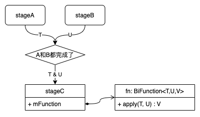

20220529-CompletableFuture学习笔记
===

* [什么是CompletableFuture](#什么是completablefuture)
* [任务编排](#任务编排)
   * [任务类型（execution）](#任务类型execution)
   * [任务触发（triggering）](#任务触发triggering)
   * [异步任务（asynchronous）](#异步任务asynchronous)
   * [编排方法一览](#编排方法一览)
   * [异步回调转链式调用](#异步回调转链式调用)
* [异常处理](#异常处理)
   * [处理方法](#处理方法)
   * [标记任务为异常](#标记任务为异常)
   * [取消](#取消)
   * [其他异常处理](#其他异常处理)
* [任务的生命周期](#任务的生命周期)
   * [创建任务](#创建任务)
      * [创建一个已经完成的任务](#创建一个已经完成的任务)
      * [创建一个未完成的任务](#创建一个未完成的任务)
      * [组合多个已有任务](#组合多个已有任务)
   * [完成任务](#完成任务)
   * [任务执行状态](#任务执行状态)
   * [任务结果](#任务结果)
* [代码示例](#代码示例)

---

# 什么是CompletableFuture

`CompletableFuture`是Java8新增的工具类，提供了约60个方法。

```java
public class CompletableFuture<T>
extends Object
implements Future<T>, CompletionStage<T>
```

`CompletableFuture`分别实现了`Future`和`CompletionStage`，且`CompletableFuture`是`CompletionStage`的唯一实现类。

`Future`定义了一种跟踪异步任务执行结果的规范，详见[Oracle文档](https://docs.oracle.com/javase/8/docs/api/java/util/concurrent/Future.html)。典型的应用场景是：

```java
future = executor.submit(callable);
result = future.get();
```

`CompletionStage`定义了一种编排异步任务的规范和语法，其中包含对异步任务的抽象、以及对任务结果的响应规范。`CompletionStage`支持了时下热门的函数式编程，用链式调用的形式描述任务工作流。`CompletionStage`只定义了任务编排的语法，而每个语法的具体实现机制，都由`CompletableFuture`定义和提供。

附上Oracle的Javadoc：[CompletableFuture](https://docs.oracle.com/javase/8/docs/api/java/util/concurrent/CompletableFuture.html)、[CompletionStage](https://docs.oracle.com/javase/8/docs/api/java/util/concurrent/CompletionStage.html)。

# 任务编排

`CompletionStage`定义了38个方法，其中大部分方法是在定义任务的各种编排语法。`CompletionStage`定义的编排语法遵循着triggering/execution的规范。

## 任务类型（execution）

`CompletionStage`支持三种类型的计算任务：

1. [Function](https://docs.oracle.com/javase/8/docs/api/java/util/function/Function.html)：接受一个入参，返回计算结果；
2. [Consumer](https://docs.oracle.com/javase/8/docs/api/java/util/function/Consumer.html)：接受一个入参，但不返回计算结果；
3. [Runnable](https://docs.oracle.com/javase/8/docs/api/java/lang/Runnable.html)：不接受入参，也不返回计算结果。

一种典型的应用场景如下面代码所示：
```java
stage.thenApply(x -> square(x)) // 用lambda表达式代替了 new Function() {...}
     .thenAccept(y -> System.out.print(y)) // Consumer
     .thenRun(() -> System.out.println()) // Runnable
```


## 任务触发（triggering）

`CompletionStage`定义了三种任务触发方式，每一种触发方式也是一种描述任务依赖关系的语法：

1. 任务B在任务A之后执行，当A完成的时候就开始执行B。这是一种单一依赖，任务B只依赖A的执行结果。这类触发方式一般用`thenAction`的形式来描述，如`stageA.thenApply(actionB)`。
2. 任务C在任务A和任务B之后执行，当A和B都完成的时候才开始执行C。任务C同时依赖了A和B的执行结果。这类触发方式的方法名一般包含`both`关键字，如`stageA.thenAcceptBoth(stageB, actionC)`。
3. 任务C在任务A或任务B之后执行，当A或B的任意一个完成后就开始执行C。任务C只依赖A或B中先完成者的执行结果。这类触发方式一般用`actionEither`的形式来描述，如`stateA.applyToEither(stageB, actionC)`。

这里以`thenCombine`方法为例说明触发方法的语义：

```java
<U,V> CompletionStage<V> thenCombine(
    CompletionStage<? extends U> other,
    BiFunction<? super T,? super U,? extends V> fn
)
```

官方文档的解释是：

> Returns a new CompletionStage that, when this and the other given stage both complete normally, is executed with the two results as arguments to the supplied function.

假如有如下代码：

```
stageC = stageA.thenCombine(stageB, fn);
```

代码表达的效果是，当`stageA`和`stageB`都完成后，才开始执行`stageC`，即`stageC`同时依赖`stageA`和`stageB`的执行结果；`stageC`执行的时候会把`stageA`和`stageB`的执行结果以入参形式传递给`fn`，并保存`fn`的返回值。执行流程如下图所示：



`CompletionStage`只定义了最多有两个依赖的语法。如果要描述三个或更多依赖，可能需要组合多个依赖描述，如：

```java
BiFunction<Integer, Integer, Integer> fn = (t, u) -> t * 10 + u;
finalStage = stage0.thenCombine(stage1, fn).thenCombine(stage2, fn).thenCombine(stage3, fn);
int value = finalStage.get();
```

`finalStage` 同时依赖 `stage0`、`stage1`、`stage2`、和`stage3`的执行结果，上例代码等效于：

```java
int value = fn(stage0.get(), stage1.get());
value = fn(value, stage2.get());
value = fn(value, stage3.get());
```


## 异步任务（asynchronous）

在编排任务的时候，可以为每个任务选择是同步执行还是异步执行。`CompletionStage`定义了三种执行方式：
1. 在默认的线程同步执行；
2. 在默认线程池异步执行；
3. 在自定义线程池异步执行。

`CompletionStage`并未定义“默认线程”是什么线程，`CompletableFuture`的实现将“默认线程”设定为触发当前`CompletionStage`执行的任务完成时所在的线程。例如任务C同时依赖了任务A和B，且A在线程1完成、B在线程2完成，如果A在B之前完成，那么C会在B的线程2同步执行。

`CompletableFuture`定义的默认线程池是[`ForkJoinPool.commonPool()`](https://docs.oracle.com/javase/8/docs/api/java/util/concurrent/ForkJoinPool.html#commonPool--) 。

以`thenCombine`方法为例说明如何描述执行方式。`thenCombine`方法有三个变体：

```java
// 同步执行
<U,V> CompletionStage<V> thenCombine(
    CompletionStage<? extends U> other,
    BiFunction<? super T,? super U,? extends V> fn
);
// 异步执行，默认线程池
<U,V> CompletionStage<V> thenCombineAsync(
    CompletionStage<? extends U> other,
    BiFunction<? super T,? super U,? extends V> fn
);
// 异步执行，自定义线程池
<U,V> CompletionStage<V> thenCombineAsync(
    CompletionStage<? extends U> other,
    BiFunction<? super T,? super U,? extends V> fn,
    Executor executor
);
```

- 同步版本的方法名不含`Async`关键字，异步版本的方法名以`Async`结尾；
- 入参包含一个`Executor`的版本需要调用者提供自定义线程池，入参不含`Executor`的版本则使用默认线程池的。

`CompletionStage`定义的几乎所有方法都提供了同步版本和异步版本，只有一个例外：`exceptionally(Function<Throwable,? extends T> fn)`方法只定义了同步版本。

## 编排方法一览

由于`CompletionStage`定义的编排语法都遵循triggering/execution的规范，所以可以按照不同的trigger和execution类型来划分`CompletionStage`定义的大量编排方法，如下表所示。表中不同行代表不同的触发（triggering）方式或依赖，不同列代表不同的任务类型。

|            | `Function<T, U>`<br />`(T) -> U` | `Consumer<T>`<br />` (T) -> Void` | `Runnable`<br />`Void -> Void` |
| ---------- | -------------------------------- | --------------------------------- | ------------------------------ |
| **single** | `thenApply`                      | `thenAccept`                      | `thenRun`                      |
| **both**   | `thenCombine`                    | `thenAcceptBoth`                  | `runAfterBoth`                 |
| **either** | `applyToEither`                  | `acceptEither`                    | `runAfterEither`               |

上表中每一个方法都有对应的异步版本。

## 异步回调转链式调用

在上表的九类编排方法之外，还有一个特殊方法——[thenCompose()](https://docs.oracle.com/javase/8/docs/api/java/util/concurrent/CompletableFuture.html#thenCompose-java.util.function.Function-)：

```java
<U> CompletionStage<U> thenCompose(Function<? super T,? extends CompletionStage<U>> fn)
```

其效果类似于`thenApply`：

```java
<U> CompletionStage<U> thenApply(Function<? super T,? extends U> fn)
```

差别在于`thenApply`的`fn`直接返回计算结果，而`thenCompose`的`fn`返回的是一个新的`CompletionStage`。

一种典型用法是把异步回调转换为链式调用：

```java
stage1 = stage0.thenCompose(x -> {
    CompletableFuture future = new CompletableFuture();
    timeExhaustingAsynchronousWork(x, future::complete);
    return future;
});
```

上例代码等效于：

```java
timeExhaustingAsynchronousWork(stage0.get(), x -> {
    // do more work
});
```

如果需要先后调用多个包含异步回调的方法，使用`thenCompose`能让代码结构变得线性：

```java
// 嵌套回调
doWork1(x, i -> {
    doWork2(i, j -> {
        doWork3(j, k -> {
            result = k;
        });
    });
});

// 改造为链式调用
result = stage1.thenCompose(x -> {
    CompletableFuture future = new CompletableFuture();
    doWork1(x, future::complete);
    return future;
}).thenCompose(i -> {
    CompletableFuture future = new CompletableFuture();
    doWork2(i, future::complete);
    return future;
}).thenCompose(j -> {
    CompletableFuture future = new CompletableFuture();
    doWork3(j, future::complete);
    return future;
}).get();
```

上例的嵌套回调又称callback hell（译做回调地狱）。关于回调地域可参考[callbackhell.com](http://callbackhell.com)的讨论，这里不做赘述。

# 异常处理

上一章所述所有编排方法，都是以任务正常完成为前提，即在所有任务的执行过程中没有发生异常、或发生的异常都被捕获并处理了。如果在某个任务执行中发生了异常，这个任务的后续任务默认都不会再执行，并同样以异常状态完成。简而言之，一个任务异常了，整个任务链都异常结束。

可以通过[`isCompletedExceptionally()`方法](https://docs.oracle.com/javase/8/docs/api/java/util/concurrent/CompletableFuture.html#isCompletedExceptionally--)来判断一个`CompletableFuture`是否因为发生异常而结束。

## 处理方法

为了支持异常处理并让任务链可以继续执行，`CompletionStage`定义了3个处理异常的方法。

1. [`exceptionally(Throwable -> T)`](https://docs.oracle.com/javase/8/docs/api/java/util/concurrent/CompletableFuture.html#exceptionally-java.util.function.Function-)：当且仅当异常发生的时候被调用，应用程序可以在这里处理异常并返回有效的计算结果（如默认值）；
2. [`handle((T, Throwable) -> U)`](https://docs.oracle.com/javase/8/docs/api/java/util/concurrent/CompletableFuture.html#handle-java.util.function.BiFunction-)：不管是否发生异常，都会被调用，应用程序可以在这里把异常或正常完成的结果转换成另外的数据类型；
3. [`whenComplete((T, Throwable) -> Void)`](https://docs.oracle.com/javase/8/docs/api/java/util/concurrent/CompletableFuture.html#whenComplete-java.util.function.BiConsumer-)：不管是否发生异常，都会被调用，但应用程序在这里无法改变任务的执行结果或异常状态；

以上三类方法，除了`exceptionally`以外，都提供了对应的异步版本。异步线程遵循[异步任务（asynchronous）](#异步任务（asynchronous）)所述规则。

```java
public <U> CompletableFuture<U> handleAsync(BiFunction<? super T,Throwable,? extends U> fn);
public <U> CompletableFuture<U> handleAsync(BiFunction<? super T,Throwable,? extends U> fn, Executor executor);
public CompletableFuture<T> whenCompleteAsync(BiConsumer<? super T,? super Throwable> action);
public CompletableFuture<T> whenCompleteAsync(BiConsumer<? super T,? super Throwable> action, Executor executor);
```

当异常被处理后（`whenComplete`除外），任务链可以回到正常状态，后续任务可以有机会继续执行。下面是一段示例代码：

```java
CompletableFuture<String> head = new CompletableFuture<>();
head.exceptionally(throwable -> {
    System.out.println(throwable.toString()); // java.lang.RuntimeException: 模拟
    return "异常" + throwable.getMessage() + "已被处理";
}).thenApply(arg -> {
    System.out.println("收到：" + arg); // 收到：异常模拟已被处理
    return arg;
}).whenComplete((arg, throwable) -> {
    System.out.println("whenComplete: " + throwable + ", " + arg); // whenComplete: null, 异常模拟已被处理
});
head.completeExceptionally(new RuntimeException("模拟"));
```


## 标记任务为异常

一个尚未完成的`CompletableFuture`可以被任务之外的代码通过[`completeExceptionally`方法](https://docs.oracle.com/javase/8/docs/api/java/util/concurrent/CompletableFuture.html#completeExceptionally-java.lang.Throwable-)标记为异常结束。标记异常等同于在任务执行中抛出了未捕获的异常。任务被标记异常后就处于完成状态了。更多相关介绍在[完成任务](#完成任务)。

```java
public boolean completeExceptionally(Throwable ex)
```

## 取消

`CompletableFuture`支持通过[`cancel`方法](https://docs.oracle.com/javase/8/docs/api/java/util/concurrent/CompletableFuture.html#cancel-boolean-)取消一个未完成的任务。

```java
public boolean cancel(boolean mayInterruptIfRunning)
```

入参`mayInterruptIfRunning`没有任何效果。

取消的本质是让任务异常完成，等效于对任务调用`completeExceptionally(new CancellationException())`。后续任务会收到一个`cause`为[CancellationException](https://docs.oracle.com/javase/8/docs/api/java/util/concurrent/CancellationException.html)的[CompletionException](https://docs.oracle.com/javase/8/docs/api/java/util/concurrent/CompletionException.html)，并因为前置任务被取消而全都异常结束。

通过[`isCancelled()`方法](https://docs.oracle.com/javase/8/docs/api/java/util/concurrent/CompletableFuture.html#isCancelled--)可以判断一个`CompletableFuture`是否已经被取消。

## 其他异常处理

如果任务异常结束，那么在获取执行结果的时候，会抛出异常。

* [`get()`](https://docs.oracle.com/javase/8/docs/api/java/util/concurrent/CompletableFuture.html#get--) 和 [`get(long, TimeUnit)`](https://docs.oracle.com/javase/8/docs/api/java/util/concurrent/CompletableFuture.html#get-long-java.util.concurrent.TimeUnit-) 会抛出`cause`为`CompletionException`的[`ExecutionException`](https://docs.oracle.com/javase/8/docs/api/java/util/concurrent/ExecutionException.html)；
* [`join()`](https://docs.oracle.com/javase/8/docs/api/java/util/concurrent/CompletableFuture.html#join--) 和 [`getNow(T)`](https://docs.oracle.com/javase/8/docs/api/java/util/concurrent/CompletableFuture.html#getNow-T-) 会直接抛出`CompletionException`；

关于上述方法的更多介绍，请参考[任务结果](#任务结果)。

# 任务的生命周期

## 创建任务

### 创建一个已经完成的任务

```java
public static <U> CompletableFuture<U> completedFuture(U value);
```

通过[静态方法`completedFuture(T)`](https://docs.oracle.com/javase/8/docs/api/java/util/concurrent/CompletableFuture.html#completedFuture-U-)可以创建一个任务，它在该方法返回的时候就已经处于已完成状态了，而且它的计算结果就是该方法的入参。

### 创建一个未完成的任务

通过构造函数可以创建一个不会自动执行任何代码的空任务：

```java
CompletableFuture<String> future = new CompletableFuture<>();
```

这样创建出来的任务会一直处于未完成的状态。应用程序需要主动完成该任务，详见[完成任务](#完成任务)。

通过[`runAsync`](https://docs.oracle.com/javase/8/docs/api/java/util/concurrent/CompletableFuture.html#runAsync-java.lang.Runnable-)可以创建一个会执行指定代码的异步任务：

```java
public static CompletableFuture<Void> runAsync(Runnable runnable);
public static CompletableFuture<Void> runAsync(Runnable runnable, Executor executor);
```

创建的任务会执行`runnable`代表的代码。当`runnable`返回的时候，任务就自动完成了。由于`Runnable`没有返回值，所以创建的任务不会传递任何结果给后续任务。

通过[`supplyAsync`](https://docs.oracle.com/javase/8/docs/api/java/util/concurrent/CompletableFuture.html#supplyAsync-java.util.function.Supplier-)能创建一个有计算结果的异步任务：

```java
public static <U> CompletableFuture<U> supplyAsync(Supplier<U> supplier);
public static <U> CompletableFuture<U> supplyAsync(Supplier<U> supplier, Executor executor);
```

`supplier`的返回时任务就自动完成了。`supplier`的返回值就是任务的执行结果。

### 组合多个已有任务

有两个静态方法提供了构造依赖多个前置任务的新任务的能力：

```java
public static CompletableFuture<Void> allOf(CompletableFuture<?>... cfs);
public static CompletableFuture<Object> anyOf(CompletableFuture<?>... cfs);
```

[`allOf`](https://docs.oracle.com/javase/8/docs/api/java/util/concurrent/CompletableFuture.html#allOf-java.util.concurrent.CompletableFuture...-)创建的任务会在所有入参传入的任务都完成的时候才会完成。完成时任务不会收到任何前置任务的计算结果。如果`allOf`没有收到任何入参，则创建的任务是结果为`null`的已完成任务。

[`anyOf`](https://docs.oracle.com/javase/8/docs/api/java/util/concurrent/CompletableFuture.html#anyOf-java.util.concurrent.CompletableFuture...-)创建的任务会在入参传入的任务中任意一个完成的时候就会完成。新任务的完成结果就是入参任务中最早完成的那个任务的结果。如果`anyOf`没有收到任何入参，创建的任务会处于未完成状态。

## 完成任务

`CompletableFuture`实现了几个实例方法，允许主动完成一个未完成的任务。任务可以被正常完成，也可以被异常完成。

调用[`complete`方法](https://docs.oracle.com/javase/8/docs/api/java/util/concurrent/CompletableFuture.html#complete-T-)可以让任务正常完成，方法入参就是任务完成的结果。

```java
public boolean complete(T value);
```

调用[`completeExceptionally`方法](https://docs.oracle.com/javase/8/docs/api/java/util/concurrent/CompletableFuture.html#completeExceptionally-java.lang.Throwable-)可以让任务异常完成。

```java
public boolean completeExceptionally(Throwable ex);
```

调用[`cancel`方法](https://docs.oracle.com/javase/8/docs/api/java/util/concurrent/CompletableFuture.html#cancel-boolean-)可以取消任务。取消本质是异常完成，详见[取消](#取消)一节。

调用[`obtrudeException`方法](https://docs.oracle.com/javase/8/docs/api/java/util/concurrent/CompletableFuture.html#obtrudeException-java.lang.Throwable-)或[`obtrudeValue`方法](https://docs.oracle.com/javase/8/docs/api/java/util/concurrent/CompletableFuture.html#obtrudeValue-T-)可以强行覆盖任务的完成状态，如在实施错误恢复的时候。使用这一对方法会有逻辑上的风险，谨慎使用。

## 任务执行状态

通过下列方法可以查询任务的执行状态：

1. [`int getNumberOfDependents()`](https://docs.oracle.com/javase/8/docs/api/java/util/concurrent/CompletableFuture.html#getNumberOfDependents--)：如果当前任务尚未完成，则返回有多少个任务直接依赖了自己；否则返回0；
2. [`boolean isCancelled()`](https://docs.oracle.com/javase/8/docs/api/java/util/concurrent/CompletableFuture.html#isCancelled--)
3. [`boolean isCompletedExceptionally()`](https://docs.oracle.com/javase/8/docs/api/java/util/concurrent/CompletableFuture.html#isCompletedExceptionally--)：因为取消本质是异常完成，所以取消的时候这里也会返回true；
4. [`boolean isDone()`](https://docs.oracle.com/javase/8/docs/api/java/util/concurrent/CompletableFuture.html#isDone--)
5. [`String toString()`](https://docs.oracle.com/javase/8/docs/api/java/util/concurrent/CompletableFuture.html#toString--)

示例：

```java
/* 任务图：
 *        /-> A -\
 * HEAD -+        +-> C -> D
 *        \-> B -/
 * * */
CompletableFuture<String> head = CompletableFuture.completedFuture("HEAD");
CompletableFuture<String> nodeA = head.thenApply(arg -> arg + "->A");
CompletableFuture<String> nodeB = new CompletableFuture<>();
CompletableFuture<String> nodeC = nodeA.thenCombine(nodeB, (a, b) -> String.format("[%s,%s]->C", a, b));
CompletableFuture<String> nodeD = nodeC.thenApply(arg -> arg + "->D");
Arrays.asList(head, nodeA, nodeB, nodeC, nodeD).forEach(it -> {
    System.out.println(it + " : getNumberOfDependents()=" + it.getNumberOfDependents());
});
```

输出：

```
CompletableFuture@28b596ca[Completed normally] : getNumberOfDependents()=0
CompletableFuture@71e49dad[Completed normally] : getNumberOfDependents()=0
CompletableFuture@7efbea18[Not completed, 1 dependents] : getNumberOfDependents()=1
CompletableFuture@6a24224[Not completed, 1 dependents] : getNumberOfDependents()=1
CompletableFuture@48091dfd[Not completed] : getNumberOfDependents()=0
```


## 任务结果

`CompletableFuture`从`Future`继承了两个获取任务结果的方法：

```java
public T get() throws InterruptedException, ExecutionException;
public T get(long timeout, TimeUnit unit) throws InterruptedException, ExecutionException, TimeoutException;
```

如果任务尚未完成，调用上面方法是会阻塞和等待。如果任务被取消了或发生了异常，上面方法会分别抛出`ExecutionException`和`CancellationException`。

```java
public T join();
public T getNow(T valueIfAbsent);
```

`CompletableFuture`提供的[`join()`方法](https://docs.oracle.com/javase/8/docs/api/java/util/concurrent/CompletableFuture.html#join--)跟[`get()`方法](https://docs.oracle.com/javase/8/docs/api/java/util/concurrent/CompletableFuture.html#get--)类似，差别在任务异常的时候会抛出`CompletionException`。

[`getNow(T)`方法](https://docs.oracle.com/javase/8/docs/api/java/util/concurrent/CompletableFuture.html#getNow-T-)不会阻塞或等待，如果任务仍未完成，则返回`valueIfAbsent`。

关于取消和异常情况的介绍，参考[取消](#取消)、[其他异常处理](#其他异常处理)、和[`CompletableFuture`的Javadoc](https://docs.oracle.com/javase/8/docs/api/java/util/concurrent/CompletableFuture.html)。

# 代码示例

这里演示用`CompletableFuture`来编排下面的任务执行图：

```
   /->B->C-\
A-+         +->F
   \->D->E-/
```

先演示在默认线程同步执行任务的效果：

```java
CompletableFuture<String> A = new CompletableFuture<>();
CompletableFuture<String> C = A.thenApply(it -> {
    System.out.println("executing: B");
    return it + "->B";
}).thenApply(it -> {
    System.out.println("executing: C");
    return it + "->C";
});
CompletableFuture<String> E = A.thenApply(it -> {
    System.out.println("executing: D");
    return it + "->D";
}).thenApply(it -> {
    System.out.println("executing: E");
    return it + "->E";
});
CompletableFuture<String> F = C.thenCombine(E, (x, y) -> {
    System.out.println("executing: F");
    return String.format("[%s,%s]->F", x, y);
});
System.out.println("calling: A.complete()");
A.complete("A");
System.out.println("calling:\tF.get()");
String value = F.get();
System.out.println("value = " + value);
```

执行结果如下：

```
calling: A.complete()
executing: D
executing: E
executing: B
executing: C
executing: F
calling:	F.get()
value = [A->B->C,A->D->E]->F
```

可以得出结论：

1. 正如[异步任务（asynchronous）](#异步任务（asynchronous）)一节所说，同步任务会在`complete()`所在线程同步执行；
2. 触发任务执行的是前置任务的完成状态，而不是调用`get()`的时候，既是说任务是以“推”的形式执行，而不是“拉”的形式；
3. `CompletableFuture`实现的执行顺序是后续深入优先遍历（这是`CompletableFuture`的内部实现细节，未来可能发生变化）；

下面演示任务代码涉及回调的场景。同样是上面的任务执行图，假设任务A~F分别对应下面的“陈年代码”：

```java
void procedureA(String arg, Consumer<String> callback) {
    executor.execute(() -> callback.accept(arg + "->A"));
}

void procedureB(String arg, Consumer<String> callback) {
    executor.execute(() -> callback.accept(arg + "->B"));
}

void procedureC(String arg, Consumer<String> callback) {
    executor.execute(() -> callback.accept(arg + "->C"));
}

void procedureD(String arg, Consumer<String> callback) {
    executor.execute(() -> callback.accept(arg + "->D"));
}

void procedureE(String arg, Consumer<String> callback) {
    executor.execute(() -> callback.accept(arg + "->E"));
}

void procedureF(String arg1, String arg2, Consumer<String> callback) {
    executor.execute(() -> callback.accept(String.format("[%s,%s]->F", arg1, arg2)));
}
```

用嵌套回调的写法会得到类似下面的代码：

```java
procedureA("HEAD", A -> {
    String[] dependencies = {null, null};
    BiConsumer<String, String> next = (x, y) -> {
        if (x != null && y != null) {
            procedureF(x, y, z -> {
                System.out.println("result = " + z);
            });
        }
    };
    procedureB(A, B -> {
        procedureC(B, C -> {
            dependencies[0] = C;
            next.accept(dependencies[0], dependencies[1]);
        });
    });
    procedureD(A, D -> {
        procedureE(D, E -> {
            dependencies[1] = E;
            next.accept(dependencies[0], dependencies[1]);
        });
    });
});
```

用`CompletableFuture`编排任务会得到类似下面的代码：

```java
CompletableFuture<String> A = CompletableFuture.completedFuture("HEAD").thenCompose(it -> {
    CompletableFuture<String> next = new CompletableFuture<>();
    procedureA(it, next::complete);
    return next;
});
CompletableFuture<String> C = A.thenCompose(it -> {
    CompletableFuture<String> next = new CompletableFuture<>();
    procedureB(it, next::complete);
    return next;
}).thenCompose(it -> {
    CompletableFuture<String> next = new CompletableFuture<>();
    procedureC(it, next::complete);
    return next;
});
CompletableFuture<String> E = A.thenCompose(it -> {
    CompletableFuture<String> next = new CompletableFuture<>();
    procedureD(it, next::complete);
    return next;
}).thenCompose(it -> {
    CompletableFuture<String> next = new CompletableFuture<>();
    procedureE(it, next::complete);
    return next;
});
String result = C.thenCombine(E, (x, y) -> {
    CompletableFuture<String> next = new CompletableFuture<>();
    procedureF(x, y, next::complete);
    return next.join();
}).join();
System.out.println("result = " + result);
```

如果使用一些重构技巧：

```java
<T> CompletableFuture<T> from(T unused, Consumer<CompletableFuture<T>> initializer) {
    CompletableFuture<T> future = new CompletableFuture<>();
    initializer.accept(future);
    return future;
}
```

可以得到类似下面的代码：

```java
CompletableFuture<String> A = CompletableFuture.completedFuture("HEAD")
    .thenCompose(it -> from(it, next -> procedureA(it, next::complete)));
CompletableFuture<String> C = A
    .thenCompose(it -> from(it, next -> procedureB(it, next::complete)))
    .thenCompose(it -> from(it, next -> procedureC(it, next::complete)));
CompletableFuture<String> E = A
    .thenCompose(it -> from(it, next -> procedureD(it, next::complete)))
    .thenCompose(it -> from(it, next -> procedureE(it, next::complete)));
String result = C.thenCombine(E,
    (x, y) -> from(x, next -> procedureF(x, y, next::complete)).join()
).join();
System.out.println("result = " + result);
```

几段代码的执行结果相同：

```
result = [HEAD->A->B->C,HEAD->A->D->E]->F
```

可以得出结论：

1. `CompletableFuture`并不一定能比嵌套回调用更少的代码完成任务编排需求；
2. `CompletableFuture`可以把嵌套回调的高维结构展开成线性结构，可以提高代码可读性；
3. 如果结合lambda表达式和一些重构技巧，确实存在可能性让代码变得非常精简；

---

[Home](/) \| [Welcome to issues!](https://github.com/PhantomQi/phantomqi.github.io/issues) \|  [Send e-mail](mailto:phantomqi@qq.com) 

