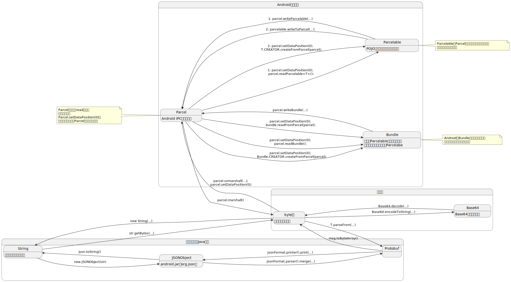

20220902-记录若干类型在Android上序列化的方法
===

* [String](#string)
   * [把String序列化为byte[]](#把string序列化为byte)
   * [把byte[]序列化为String](#把byte序列化为string)
* [Parcel系列：Parcel、Parcelable、Bundle](#parcel系列parcelparcelablebundle)
   * [把Parcel序列化为byte[]](#把parcel序列化为byte)
   * [把Parcelable转换为Parcel](#把parcelable转换为parcel)
   * [把Bundle转换为Parcel](#把bundle转换为parcel)
   * [用例演示](#用例演示)
* [JSON](#json)
* [Protobuf](#protobuf)
   * [把Protobuf序列化为byte[]](#把protobuf序列化为byte)
   * [Protobuf与JSON互转](#protobuf与json互转)
* [总结](#总结)

---

近期一项工作涉及把复杂内存数据跨进程、跨设备传输。借此机会梳理了若干常用类型在Android上实现序列化和互通的方法。

本文所讨论的序列化，是指数据类型和数据结构与`byte[]`的相互转换（序列化&反序列化）。一个类型要能直接或间接的转换为`byte[]`，才算满足了跨进程和跨端通信的必要条件。

本文不讨论基于`Serializable`的序列化方法。本文只讨论若干具有代表性、通用性的类型在Android上序列化的方法。Java内置内型、其他各类数据结构，都可以通过转换为本文所述的类型、或用本文所述数据容器封装，来获得序列化能力。

# String

首先来说`String`。虽然很多场合把`String`直接视为可直接收发的数据类型，但实际最终要转换为`byte[]`才能在进程间拷贝、在网络上传输。`String`和`byte[]`的相互转换要考虑编码的问题，下面分两种场景说明他们互转的方法：

1. 输入`String`，要序列化为`byte[]`；
2. 输入`byte[]`，要序列化为`String`；

## 把String序列化为byte[]

`String`自带了序列化为`byte[]`以及从`byte[]`反序列化的方法，这不讨论加解密或压缩算法等复杂算法。在执行序列化或反序列化的时候需要指定编解码的Codec，如`UTF-8`、`UTF-16BE`、`UTF-16LE`等，这里仅以网络传输常用的`UTF-8`为例。

```java
@Test
public void 验证把String序列化为bytes_并反序列化为正确的String() throws UnsupportedEncodingException {
    String text = "testString中文";
    byte[] bytes = text.getBytes("UTF-8");
    println("bytes=" + deepToString(bytes));
    String result = new String(bytes, "UTF-8");
    println("result=" + result);
    Assert.assertEquals(text, result);
}
```

用例运行结果：

```
bytes=[74,65,73,74,53,74,72,69,6e,67,e4,b8,ad,e6,96,87]
result=testString中文
```


## 把byte[]序列化为String

存在一些场合，输入的数据是任意的`byte[]`，但需要序列化为`String`：

- 打印到日志做人肉分析
- 存储到`SharedPreference`、xml、dababase等
- 存入JSON、Yaml等对可读性有需求的数据格式

一种典型方法是用`Base64`做编解码，相比`String.format("%02x", b)`而言可以节省字符串长度。

```java
import android.util.Base64;

public static String encodeToString(byte[] bytes) {
    return Base64.encodeToString(bytes, Base64.DEFAULT);
}

public static byte[] decodeToBytes(String s) {
    return Base64.decode(s, Base64.DEFAULT);
}
```

单测用例：

```java
static String deepToString(byte[] bytes) {
    Byte[] array = new Byte[bytes.length];
    for (int i = 0; i < bytes.length; ++i) {
        array[i] = bytes[i];
    }
    return "[" + Arrays.stream(array).map(b -> String.format("%02x", b)).collect(Collectors.joining(",")) + "]";
}

@Test
public void 验证bytes通过Base64与String序列化和反序列化的可用性() {
    byte[] bytes = {0x11, 0x55, (byte) 0x99, (byte) 0xaa, (byte) 0xee, (byte) 0xff};
    System.out.println("bytes=" + deepToString(bytes));
    String str = encodeToString(bytes);
    System.out.println("base64=" + str);
    byte[] result = decodeToBytes(str);
    System.out.println("result=" + deepToString(result));
    Assert.assertArrayEquals(bytes, result);
}
```

运行结果：

```
bytes=[11,55,99,aa,ee,ff]
base64=EVWZqu7/

result=[11,55,99,aa,ee,ff]
```


# Parcel系列：Parcel、Parcelable、Bundle

Android的IPC（如四大组件相关调用）都以`Bundle`为数据容器，容纳其他可序列化的数据类型。`Bundle`实现了`Parcelable`，`Parcelable`定义了写入数据到`Parcel`和从`Parcel`恢复数据的方法，最后`Parcel`负责把数据序列化为`byte[]`或从`byte[]`反序列化。

## 把Parcel序列化为byte[]

序列化：

```java
Parcel parcel = Parcel.obtain();
// TODO: write something into parcel here
byte[] bytes = parcel.marshall();
parcel.recycle();
// TODO: now save or send bytes
```

反序列化：

```java
Parcel parcel = Parcel.obtain();
parcel.unmarshall(bytes, 0, bytes.length);
parcel.setDataPosition(0);
// TODO: read something from parcel here
parcel.recycle();
```

这里有一点注意：在`unmarshall()`之后、从`parcel`读数据之前，一定要调用`parcel.setDataPosition(0)`，否则可能任何数据都读不出来。

## 把Parcelable转换为Parcel

方法1：

```java
// 写入
parcel.writeParcelable(parcelable, flags);
// 读出
Parcelable parcelable = parcel.readParcelable(classLoader);
```

方法2：

```java
// 写入
parcelable.writeToParcel(parcel, flags);
// 读出
Parcelable parcelable = T.CREATOR.createFromParcel(parcel);
```

需要注意的是：上述两套方法不能交叉使用，否则无法从`Parcel`正确读出`Parcelable`对象或抛出`ClassNotFoundException`异常。根据`Parcel`的源码，方法1复用了方法2的实现，并且额外写入了`Parcelable`对象的真实类名。在读出的时候，会根据自定义对象的类名，反射寻找`CREATOR`；如果`CREATOR`不存在，则会让读出过程失败。

## 把Bundle转换为Parcel

`Bundle`实现了`Parcelabl`接口，可以以普通的`Parcelable`身份写入`Parcel`或从`Parcel`读出。`Parcel`为`Bundle`实现了额外一套接口，相比`Parcelable`提供了不同的实现。这里介绍在`Parcelable`之外、`Bundle`类特有的读写方法。

```java
// 写入
parcel.writeBundle(bundle);
// 读出方法1
bundle = parcel.readBundle();
// 读出方法2
bundle.readFromParcel(parcel);
// 读出方法3
Bundle.CREATOR.createFromParcel(parcel);
```

由于Android为`Bundle`提供了特殊照顾，推测`Bundle`和`Parcel`的各个转换方法可以混用。该推测经过初步测试验证通过，但笔者并未做完备的测试、也未透彻的分析过源码，本结论仅供参考。

## 用例演示

部分用例代码如下：

```java
void 实验Bundle的转换一致性(Function<Bundle, Bundle> transform) {
    String key = "key", value = "value";
    Bundle bundle1 = new Bundle();
    bundle1.putString(key, value);
    println("bundle1=" + bundle1);

    Bundle bundle2 = transform.apply(bundle1);
    String result = bundle2.getString(key, null);
    println("bundle2=" + bundle2);
    println("result=" + result);

    Assert.assertEquals(value, result);
}

void 通过bytes验证Bundle的双向转换(Function<Bundle, byte[]> marshall, Function<byte[], Bundle> unmarshall) {
    实验Bundle的转换一致性(bundle1 -> {
        byte[] bytes = marshall.apply(bundle1);
        System.out.println("bytes=" + deepToString(bytes));
        Bundle bundle2 = unmarshall.apply(bytes);
        return bundle2;
    });
}

@Test
public void 演示Bundle到bytes的序列化和反序列化() {
    通过bytes验证Bundle的双向转换(bundle -> {
        Parcel parcel = Parcel.obtain();
        parcel.writeBundle(bundle);
        byte[] bytes = parcel.marshall();
        parcel.recycle();
        return bytes;
    }, bytes -> {
        Parcel parcel = Parcel.obtain();
        try {
            parcel.unmarshall(bytes, 0, bytes.length);
            parcel.setDataPosition(0);
            return Bundle.CREATOR.createFromParcel(parcel);
        } finally {
            parcel.recycle();
        }
    });
}
```

用例运行结果：

```
bundle1=Bundle[{key=value}]
bytes=[ac,ed,00,05,77,08,00,00,00,06,00,00,00,04,73,72,00,11,6a,61,76,61,2e,6c,61,6e,67,2e,49,6e,74,65,67,65,72,12,e2,a0,a4,f7,81,87,38,02,00,01,49,00,05,76,61,6c,75,65,78,72,00,10,6a,61,76,61,2e,6c,61,6e,67,2e,4e,75,6d,62,65,72,86,ac,95,1d,0b,94,e0,8b,02,00,00,78,70,00,00,00,24,77,04,00,00,00,04,73,71,00,7e,00,00,4c,44,4e,42,77,04,00,00,00,04,73,71,00,7e,00,00,00,00,00,01,77,04,00,00,00,0c,74,00,03,6b,65,79,77,04,00,00,00,04,73,71,00,7e,00,00,00,00,00,00,77,04,00,00,00,10,74,00,05,76,61,6c,75,65]
bundle2=Bundle[{key=value}]
result=value
```


# JSON

本文对JSON的讨论范围仅限于android.jar自带的`org.json.JSONObject`类，且不借助与第三方库。

`JSONObject`可以与`String`相互转换：

```java
// JSONObject -> String
String str = json.toString();
// String -> JSONObject
json = new JSONObject(str);
```

下面的用例验证了`JSONObject`和`String`的相互转换效果：

```java
@Test
public void 验证JSONObject与String的双向转换() throws JSONException {
    JSONObject x = new JSONObject();
    x.put("query", "Pizza");
    x.put("price", 3.5);
    System.out.println("x=" + x);

    System.out.println("0=" + x.toString());
    System.out.println("4=" + x.toString(4));

    String str = x.toString(4);
    JSONObject y = new JSONObject(str);
    System.out.println("y=" + y);

    x.keys().forEachRemaining(key -> Assert.assertEquals(x.opt(key), y.opt(key)));
    y.keys().forEachRemaining(key -> Assert.assertEquals(x.opt(key), y.opt(key)));
}
```

用例运行结果：

```
x={"query":"Pizza","price":3.5}
0={"query":"Pizza","price":3.5}
4={
    "query": "Pizza",
    "price": 3.5
}
y={"query":"Pizza","price":3.5}
```


# Protobuf

本节内容基于以下依赖：

```groovy
dependencies {
    implementation 'com.google.protobuf:protobuf-java:3.21.2'
    implementation 'com.google.protobuf:protobuf-java-util:3.21.2'
}
```


## 把Protobuf序列化为byte[]

Protobuf不是由Android提供的，Protobuf支持多种语言、多种平台。

Protobuf的message对象可以序列化为`byte[]`。假设有如下message定义：

```protobuf
syntax = "proto2";
message Person {
  optional string name = 1;
  optional string email = 2;
}
```

`Person`对象序列化为`byte[]`：

```java
byte[] bytes = person.toByteArray();
```

从`byte[]`反序列化：

```java
person = Person.parseFrom(bytes);
```

下面的用例验证了`Person`对象和`byte[]`互相转换的效果：

```java
@Test
public void 验证Protobuf的message与bytes的互相转换效果() throws InvalidProtocolBufferException {
    Person from = Person.newBuilder().setName("tom").setEmail("tom@mail.com").build();
    println("from=" + from);

    byte[] bytes = from.toByteArray();
    println("bytes=" + deepToString(bytes));

    Person to = Person.parseFrom(bytes);
    println("to=" + to);

    Assert.assertEquals(from, to);
}
```

用例运行结果：

```
from=name: "tom"
email: "tom@mail.com"

bytes=[0a,03,74,6f,6d,12,0c,74,6f,6d,40,6d,61,69,6c,2e,63,6f,6d]
to=name: "tom"
email: "tom@mail.com"
```


## Protobuf与JSON互转

Protobuf的message可以与JSON互转。下面的用例依赖了`protobuf-java-util`：

```java
@Test
public void 验证Protobuf的message与JSON的互转效果() throws InvalidProtocolBufferException {
    Person from = Person.newBuilder().setName("tom").setEmail("tom@mail.com").build();
    System.out.println("from=" + from);

    // protobuf -> json
    String jsonStr = JsonFormat.printer().print(from);
    System.out.println("jsonStr=" + jsonStr);

    JSONObject json = null;
    try {
        json = new JSONObject(jsonStr);
        System.out.println("json=" + json);
    } catch (JSONException e) {
        Assert.fail(e.toString());
    }

    // json -> protobuf
    Builder builder = Person.newBuilder();
    JsonFormat.parser().merge(json.toString(), builder);
    Person to = builder.build();
    System.out.println("to=" + to);

    Assert.assertEquals(from, to);
}
```

用例运行结果：

```
from=name: "tom"
email: "tom@mail.com"

jsonStr={
  "name": "tom",
  "email": "tom@mail.com"
}
json={"name":"tom","email":"tom@mail.com"}
to=name: "tom"
email: "tom@mail.com"
```

更多介绍可跳转：[Protobuf官网](https://developers.google.cn/protocol-buffers/) 和 [javadoc](https://developers.google.cn/protocol-buffers/docs/reference/java)。

# 总结

用一张图来归纳本文的关键内容：



