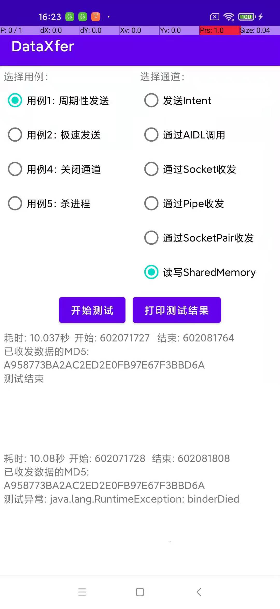

20230416-Android跨进程数据通道若干方案的实验笔记
===

* [一、实验背景和目标](#一实验背景和目标)
   * [i. 数据通道的功能性指标](#i-数据通道的功能性指标)
   * [ii. 非功能性指标](#ii-非功能性指标)
* [二、实验方案](#二实验方案)
   * [i. 测试方案](#i-测试方案)
      * [测试场景](#测试场景)
      * [用例方案](#用例方案)
      * [通道工厂和数据通道](#通道工厂和数据通道)
   * [ii. 被测试的通道方案](#ii-被测试的通道方案)
      * [通过Intent传输](#通过intent传输)
      * [通过‘基于AIDL的IPC‘传输](#通过基于aidl的ipc传输)
      * [通过SocketChannel传输](#通过socketchannel传输)
      * [通过Pipe传输](#通过pipe传输)
      * [通过SockerPipe传输](#通过sockerpipe传输)
      * [通过ShareMemory传输](#通过sharememory传输)
   * [iii. 测试数据采集方案](#iii-测试数据采集方案)
      * [采集CPU占用](#采集cpu占用)
      * [采集电量消耗](#采集电量消耗)
      * [采集耗时、延迟等](#采集耗时延迟等)
* [三、实验结果](#三实验结果)
   * [i. 功能性指标对比](#i-功能性指标对比)
   * [ii. 非功能性指标对比](#ii-非功能性指标对比)


# 一、实验背景和目标

我想做一个Android平台的跨进程数据通道，通过这个通道支持若干App之间的数据传输。我想到了一些传输方案，但是缺乏在方案中做出选型的评价依据。本实验会基于若干方案实现数据传输通道，在模拟的业务场景中进行实验，从功能性指标和非功能性指标对各方案做出评价。

## i. 数据通道的功能性指标

1. 数据由A进程产生，从A进程传输到B进程。
2. 数据是在一段时间内陆续产生的，数据的长度事先不确定。
3. 每产生一段数据就要立即从A进程发送到B进程，不能等到数据产生完了再一次性传输。
4. B进程需要及时接收数据，接收数据不能有太大延迟，更不能等到A完成了数据发送才一次性接收。换句话说，B进程要能及时感知A进程发送了数据。
5. B进程接收的数据必须是完整的。
6. B进程要能感知A进程结束了数据发送。
7. 如果A进程死亡了，B进程要能够感知到。

## ii. 非功能性指标

1. 对比各传输方案的传输效率和响应延迟
   1. 传输效率=传输数据量÷max(A进程完成发送的耗时, B进程完成接收的耗时)
   2. 响应延迟=B进程收到数据的时刻-A进程发送数据的时刻
2. 在相同传输场景下对比各传输方案的CPU占用
3. 对比各传输方案的功耗

# 二、实验方案

我实现了一个包含如下界面的测试工程，对若干传输方案进行了测试。



测试中首先选择用例和通道，然后点击“开始测试”，等待测试结束。下方两个文本框分别显示A进程和B进程的状态。

## i. 测试方案



### 测试场景

主进程：

1. 由`MainActivity`提供：1）测试用例和通道的选项；2）操作按钮；3）展示`:provider`进程和`:consumer`进程回传的测试状态。
2. 开始测试时先启动`:consumer`进程，准备好接收数据。然后启动`:provider`进程。

`:provider`进程：

1. 定义`ProviderService`，以前台服务身份运行，保障进程具有较高的优先级。
2. 通过`XferFactory`创建通道实例，将通道实例注入到`IUsecase`的实例对象。
3. 通过`UsecaseFactory`创建用例，通过用例产生数据。
4. 按照固定时间间隔周期性的把测试状态发给`MainActivity`。

`:consumer`进程：

1. 定义`ConsumerService`，以前台服务身份运行，保障进程具有较高的优先级。
2. 通过`XferFactory`创建通道实例，接收从`:provider`进程发来的数据。
3. 按照固定时间间隔周期性的把测试状态发给`MainActivity`。

### 用例方案

**用例的职责：**

1. 产生待发送的数据，不同用例支持不同的数据规模。
2. 调用注入的`IXfer`实例对象发送数据。
3. 实现不同的数据发送节奏。
4. 调用`IXfer`的接口关闭通道，或杀死`:provider`进程。
5. 把发送的数据回调给`ProviderService`，异步计算被发送数据的MD5，用于跟`:consumer`进程对比。

**测试数据：**

1. 数据取自一段中文文本，文本以txt（UTF8）格式存放于`assets`目录。
2. 文本读取到内存中，按300个字符分割，每次发送一个分片。
3. 各用例可以发送其中部分文本，可以循环发送多次文本。
4. 为避免IO影响测试过程的性能，由用例工厂在进程启动的时候准备好测试数据，各用例实例仅从内存中取出数据来发送。

**用例实例：**

1. 用例1：周期性发送
   1. 按固定周期发送数据。
   2. 可以验证数据通道是否支持`:consumer`进程及时接收数据。
2. 用例2：极速发送
   1. 在一个循环内不停的发送数据。
   2. 数据通道应当同步发送数据，这样才能验证数据通道的传输效率。
3. 用例4：关闭通道
   1. 由数据通道提供关闭能力，用例仅负责调用数据通道的接口。
   2. 验证数据通道是否支持让`:consumer`进程感知通道关闭。
4. 用例5：杀进程
   1. 直接杀掉`:provider`进程。
   2. 验证数据通道是否支持让`:consumer`进程感知`:provider`进程的状态。

### 通道工厂和数据通道

1. 通过工厂创建具体的数据通道，做到数据通道和用例解耦。
2. 由一个类实现一个数据通道方案，`:provider`进程和`:consumer`进程使用同一个数据通道类，两个进程分别调用不同的接口来启动数据发送和数据接收。
3. `:consumer`进程的数据通道把收到的数据按顺序回调给`ConsumerService`，异步计算MD5，跟`:provider`进程做对比，验证数据完整性。

## ii. 被测试的通道方案

本实验的通道方案包含如下限制：

1. 仅通过Java代码编写，调用Android或JDK接口，不涉及JNI。
2. 不能保证这些方案之外没有其他更好的方案。
3. 尽量同步发送、同步接收，以体现收发行为本身对传输效率的影响。

下面记录本实验各数据通道的关键方案。

### 通过Intent传输

发送数据：把数据放到`Intent`中，调用`startService()`。最后发送一个`Intent`告知数据传输结束。通过`Intent`中的`action`区分数据和信令。

接收数据：响应`onStartCommand()`，从`Intent`中取出数据。根据`Intent`中的信令判断数据是否接收结束。

### 通过‘基于AIDL的IPC‘传输

建立连接：`bindService()`/`onBind()`

断开链接：`unbindService()`

AIDL定义：

```java
interface IAidlXferInterface {
    void reverseBind(IBinder binder);
    void doTransfer(String data);
    void close(); // 告知数据发送结束
}
```

感知链接断开或进程退出：通过`reverseBind()`让`:consumer`进程持有`:provider`进程的一个对象，通过`DeathRecipient`感知对方的状态。

```java
@Override
public void reverseBind(IBinder binder) throws RemoteException {
    binder.linkToDeath(() -> {
        //:provider进程死了
    }, 0);
}
```


### 通过SocketChannel传输

建立连接/断开链接：`:consumer`作为服务端，`:provider`作为客户端，建立和断开链接遵循`SocketChannel`的常规用法，其中IP使用`127.0.0.1`。

发送数据/接收数据：通过`DataOutputStream.writeUTF()`和`DataInputStream.readUTF()`收发数据，

感知链接断开/感知进程退出：`DataInputStream.readUTF()`时如果捕获到`SocketException`或`EOFException`，就认为链接已经断开了。在数据收发中如果发生了上述异常之外的异常，也视为链接断开。

### 通过Pipe传输

建立连接：

1. 通过`ParcelFileDescriptor.createPipe()`创建成对的Pipe对象，以FD的形式返回。
2. 通过IPC把第零个FD发送到`:consumer`进程。注意FD不能直接通过`Intent`发送，这里存在一些技巧。

断开链接：把FD给`close()`掉。

发送数据/接收数据：通过FD构造`DataOutputStream`和`DataInputStream`，分别用于数据发送和接收。

感知链接断开/感知进程退出：如果捕获到`EOFException`，就视为链接断开。如果捕获到其他异常，则视为`:provider`进程异常，链接已不可用。

### 通过SockerPipe传输

跟通过Pipe传输基本相同，关键差异在于创建FD对的接口改用`ParcelFileDescriptor.createSocketPair()`。

### 通过ShareMemory传输

建立连接：`ShareMemory`是`Parcelable`，可以跨进程传输。但由于内部是FD，不能直接通过`Intent`传输，需要一些技巧。

断开链接/感知链接断开/感知进程退出：`ShareMemory`本身没有连接属性。要借助其他辅助方案，比如借助AIDL、或在内存中约定一个flag。

发送数据/接收数据：

1. `ShareMemory`需要指定地址空间的长度，本身并不能无限制的写入数据。为了支持任意长度的传输容量，这里把有限的内存空间做成一个环形缓冲区，内存中保留若干字节作为缓冲区的读写指针。
2. 发送数据的时候，按照写指针的位置写入数据，然后移动写指针。注意写的时候不要覆盖了读指针指向的位置。如果没有足够的空间写入数据，要等待&轮询，直到读指针发生移动，留出了可以写数据的空间。
3. 读数据的时候，轮询检测写指针和读指针的差距，发现有可以读的数据，就立马读出来，然后更新读指针到写指针的位置。
4. 轮询的时间间隔关乎性能和效率的平衡。

## iii. 测试数据采集方案

### 采集CPU占用

1. 重启测试app进程

2. 在`adb shell`中启动CPU数据采集

   ```bash
   function record_cpu() {
       xfer=$1 # 通道方案名称
       pkg=$2 # 测试app的packageName
       uid=$(top -o PID,USER,%CPU,CMDLINE -b -n 1 | grep $pkg | grep -v 'shell' | awk '{print $2}')
       echo "uid=$uid"
       top -o PID,USER,%CPU,CMDLINE -b -d 0.015 -u $uid | grep $pkg | tee /sdcard/temp/cpu_${xfer}_$(date +%Y%m%dT%H%M%S).txt
   }
   ```

3. 对一个通道方案进行测试，测试以“用例1：周期性发送”为测试场景（这样才能保证统计数据没有干扰因素）

4. 通过`Ctrl+C`终止CPU数据采集

5. 从`sdcard`导出CPU数据，统计`:provider`和`:consumer`进程的CPU占用（本实验不统计主进程的CPU占用）

### 采集电量消耗

参考了帖子[Android App性能优化——内存、CPU、耗电量、启动时间指标获取](https://zhuanlan.zhihu.com/p/556830667)的内容。

1. 连接手机，重启测试app，重置电量统计

   ```bash
   dumpsys batterystats --reset
   dumpsys batterystats --enable full-wake-history
   ```

2. 断开手机，执行测试

3. 重新连接手机，打印电量数据

   ```bash
   pkg= # 填写测试app的packageName
   uid=$(dumpsys batterystats | grep $pkg | head -1 | grep -oE 'u[0-9a-f]*a[0-9a-f]*')
   echo "uid=$uid"
   dumpsys batterystats | awk 'BEGIN{c=0} /Estimated power use/{c=1} {if(c==1){print $0}}' | grep "Uid $uid"
   ```


### 采集耗时、延迟等

在代码中准确记录数据收发的起止时间点，在测试结束后以日志形式打印出来。


# 三、实验结果

本实验的数据绝对存在误差，不保证能经受住高标准的挑战。本实验通过以下措施保障了测试结果具有一定的可信度：

1. 事先对所有待测试的通信方案做了验证，保证接收的数据的MD5和发送的数据的MD5是相等的。即使说，数据通道在测试中能保证数据完整性。
2. 所有测试在同一部手机上测试完成。手机上没有安装过多应用，避免出现各类应用在后台运行影响测试数据。
3. 所有测试尽量保证在连续的两三个小时内完成，避免时间段隐含的环境差异性影响测试数据。
4. 每一轮测试都重启应用，避免潜在的技术问题影响测试数据。
5. 测试数据按10次测试的平均值算，尽量抹平随机因素的干扰。
6. 一些连续操作采用adb命令模拟点击实现，避免手动操作引入误差。
7. 用release版本的apk做测试，避免构建中保留的调试代码影响测试数据。


## i. 功能性指标对比

**传输方案的可用性：**

1. 实验中所有传输方案都有能力保障数据完整性。
2. 各传输方案都有能力支持不确定长度的数据传输。
3. 各传输方案都有能力支持无限长的数据传输。

**传输方案的通道特性：**

1. 对发送方来说，可以随时发送数据。数据长度可能有限制，但只要不超过长度限制，就可以发送任意长度的数据。

2. 对接收方来说，都有能力感知到有数据发送，都能够及时接收数据。

3. 各传输方案本身都有能力支持连接主动关闭或通知数据发送结束（不借助其他辅助方案，单纯基于本传输方案的特性）

   | 传输方案      | 主动关闭的方案对比                                           |
   | ------------- | ------------------------------------------------------------ |
   | Intent        | 通过`action`区分数据和信令，其中可以定义数据发送完毕的信令   |
   | AIDL          | 在接口定义中约定通知数据发送完毕的方法                       |
   | Pipe          | 关闭FD                                                       |
   | SocketPipe    | 关闭FD                                                       |
   | SocketChannel | 关闭`Socket`                                                 |
   | SharedMemory  | 约定某些字节表示传输状态，其中包含一个flag，标志数据传输是否结束 |

   基于SharedMemory的传输通道也可以借助Intent或AIDL间接实现主动关闭方案。

4. 各传输方案中，有些方案无法在没有其他辅助方案的前提下感知通道的被动断开（如接收进程能否感知到发送进程的死亡）

   | 传输方案      | 直接感知通道被动断开的能力                                   |
   | ------------- | ------------------------------------------------------------ |
   | Intent        | 通道本身是无连接的，无直接感知能力。                         |
   | AIDL          | 如果是接收方向发送方`bindService()`，则通过`onServiceDisconnected()`实现感知能力。如果是发送方向接收方`bindService()`，则需要发送方把一个`IBinder`对象传给接收方，接收方通过`DeathRecipient`实现感知能力。 |
   | Pipe          | 通过读写异常感知。                                           |
   | SocketPipe    | 通过读写异常感知。                                           |
   | SocketChannel | 通过读写异常感知。                                           |
   | SharedMemory  | 通道本身是无连接的，无直接感知能力。                         |

   对于不具有直接感知能力的通道方案，可以借助`DeathRecipient`间接实现感知能力。


## ii. 非功能性指标对比

**关键结论先行：**

1. 性价比（效率/性能）方面，SharedMemory是最高的方案，而Intent是最低的（AIDL紧随其后），其他方案居中基本持平。
2. 上述性价比评价，没有包含开发难度的维度。Intent和AIDL的开发难度是最低的，SharedMemory是最高的，其他方案居中基本持平。

总的来说，这里不存在单一的优劣评价，具体业务/项目需要根据自身情况综合决策。


**传输效率：**

|              | Intent | AIDL | Pipe | SocketPipe | SocketChannel | SharedMemory |
| ------------ | :----: | :--: | :--: | :--------: | :-----------: | :----------: |
| 每秒可传输的数据量 | 94 KB | 469 KB | 5.36 MB | 3.89 MB | 3.77 MB | 6.72 MB |
| 数据发送总耗时（秒） | 15.560 | 3.126 | 0.261 | 0.369 | 0.205 | 0.168 |
| 数据接收总耗时（秒） | 15.560 | 3.116 | 0.267 | 0.369 | 0.380 | 0.213 |
| 接收到第一段数据的延迟（毫秒） | 1.9 | 0.4 | 1.450 | 1.650 | 0.450 | 2 |
| 接收到最后一段数据的延迟（毫秒） | 0.95 | -9.8 | 8.050 | 1.550 | 175.850 | 46.9 |

各传输方案的优劣在数据上可以直观的体现出来，这里不做过多解读，但有几个数据需要做出说明：

1. AIDL的发送耗时高于接收耗时，其底层原因是AIDL默认是同步调用，被调用方先返回了，主调方才能返回。
2. AIDL接收最后一段数据的延迟是负数，其底层原因同上。
3. SharedMemory的延迟取决于轮询的方案中对轮询间隔的设计。间隔大则延迟大，间隔小则可能引入CPU和功耗风险。
4. SocketChannel接收最后一段数据的延迟看起来似乎太大了，这个问题本实验未深入调查原因，本文无法做出过多评价，姑且认为就是现实情况。


**平均CPU占用：**

|              | Intent | AIDL | Pipe | SocketPipe | SocketChannel | SharedMemory |
| ------------ | :----: | :--: | :--: | :--------: | :-----------: | :----------: |
| 发送进程（%） | 25 | 71 | 168 | 141 | 207 | 145 |
| 接收进程（%） | 49 | 80 | 174 | 158 | 166 | 34 |


**平均能耗：**

|              | Intent | AIDL | Pipe | SocketPipe | SocketChannel | SharedMemory |
| ------------ | :----: | :--: | :--: | :--------: | :-----------: | :----------: |
| 平均能耗（mAh） | 0.2893 | 0.1944 | 0.0347 | 0.04 | 0.05086 | 0.0179 |

