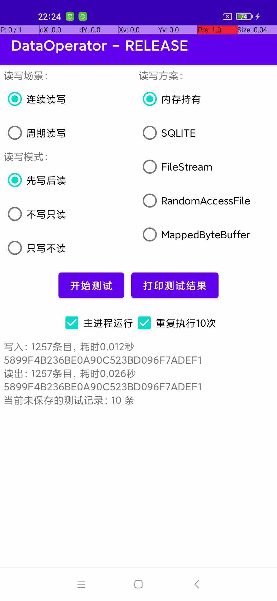

20230704-Android数据持久化若干方案的对比实验笔记
===

* [一、实验背景和目标](#一实验背景和目标)
* [二、实验方案](#二实验方案)
   * [i. 实验测试方案](#i-实验测试方案)
      * [测试数据源](#测试数据源)
      * [读写场景](#读写场景)
      * [读写模式](#读写模式)
      * [实验界面截图](#实验界面截图)
   * [ii. 数据持久化方案](#ii-数据持久化方案)
      * [排除实验方案引入的干扰因素](#排除实验方案引入的干扰因素)
      * [对照组：非持久化，仅内存持有](#对照组非持久化仅内存持有)
      * [实验组：SQLITE数据库](#实验组sqlite数据库)
      * [实验组：FileStream](#实验组filestream)
      * [实验组：RandomAccessFile](#实验组randomaccessfile)
      * [实验组：MappedByteBuffer](#实验组mappedbytebuffer)
   * [iii. 测试数据采集方案](#iii-测试数据采集方案)
      * [读写速率](#读写速率)
      * [CPU占用率](#cpu占用率)
      * [功耗](#功耗)
      * [减少测试过程的干扰因素](#减少测试过程的干扰因素)
* [三、实验结果](#三实验结果)
   * [i. 读写速率（单位：毫秒）](#i-读写速率单位毫秒)
   * [ii. CPU占用率（单位：%）](#ii-cpu占用率单位)
   * [iii. 功耗（单位：mAh）](#iii-功耗单位mah)

# 一、实验背景和目标

我面临一个数据持久化场景，该场景具有下列特征：

1. 每一条数据具有比较一致的结构。
2. 每一批数据的规模大致可以估算。
3. 数据是陆续的产生，每一条数据之间的间隔是随机的，但不会太长（每两条数据间隔不会超过5s）。
4. 每一条数据产生后，都需要做持久化；待一批数据全部产生完之后，需要全部读出来进行后续处理。

存在若干技术方案可以满足上述场景的持久化需求，但缺乏方案选型的依据。本实验基于若干技术方案模拟实现上述场景，期望能在如下非功能性指标上获得对比数据：

1. 最高读写速率。
2. CPU占用率。
3. 功耗。

# 二、实验方案

## i. 实验测试方案

### 测试数据源

测试数据产生自一个文本文件，内容是一篇中文剧本，文件按UTF8编码不超过30KB。测试数据是`String`的`List`，每个`String`不超过原文本的一行，且不超过300个字符。数据源在测试程序启动的时候事先读取到内存中，数据准备过程不会影响测试结果。为保障测试过程有足够大的数据规模，测试过程中把原数据循环使用了3轮。

### 读写场景

实验中把读写场景分为两类：连续读写和周期性读写。

连续读写就是在一个循环中不停地读写直到遍历完数据源。通过连续读写可以测试各类持久化方案的读写速率。这里需要各持久化方案采用同步IO（本实验涉及的IO接口基本都是同步的）。在这种场景下也可以观察在极限情况下的CPU占用和功耗情况。

周期性读写是为了模拟需求场景。在实验中按每5毫秒执行一次读或写。通过周期性读写可以观察在接近真实业务场景的情况下各持久化方案引入的CPU占用和功耗情况。

### 读写模式

实验中把读写模式分为三类：先写后读、只读和只写。先写后读是实验背景中提到的需求场景。只读和只写是为了对比读写过程的差异。

### 实验界面截图



为便于统计CPU占用，让测试代码在子进程中运行，并在一轮测试结束后立即结束子进程。子进程通过前台`Service`来实现。使用前台`Service`是为了避免CPU调度策略影响测试结果。

为避免进程启动对功耗的影响，同时支持在主进程执行测试代码。

为方便自动化测试和避免手动操作引入的干扰因素，在程序内支持按相同参数连续执行10次测试。

## ii. 数据持久化方案

### 排除实验方案引入的干扰因素

为了保障每一个实验组实现的代码都是正确的，采集测试数据前对每一个持久化方案的写入数据和读出数据作了MD5校验，确认读出的数据与写入的数据完全相同，保证读写过程没有导致数据产生错误。

每个实验组都使用相同的测试数据源，保障数据源不会给各实验组引入干扰因素。

实验中采用如下简单的数据结构，避免数据格式转换过程给实验引入太大干扰。

```kotlin
/* 代表一条被读写的数据 */
data class DataEntry(
    val data: String
)
```

在IO过程中，字符串按UTF8编解码。

### 对照组：非持久化，仅内存持有

**数据格式和持有方式：**`List<String>`

**写数据：**`list.add(data)`

**读数据：**遍历数据源

### 实验组：SQLITE数据库

**数据格式：**

```sqlite
create table $TABLE_NAME (
    $KEY_ID integer primary key AUTOINCREMENT,
    $KEY_DATA text)
```

**写数据：**

```kotlin
// dbHelper = MyDbHelper(Env.context)
// db = dbHelper.writableDatabase

override fun write(data: String) {
    db.insert(TABLE_NAME, null, ContentValues().apply {
        put(KEY_DATA, data)
    })
}
```

**读数据：**

```kotlin
cursor = db.query(TABLE_NAME, arrayOf(KEY_DATA), null, null, null, null, "$KEY_ID asc")
//一次query，复用cursor直到遍历完所有数据
return cursor.getString(cursor.getColumnIndex(KEY_DATA))
```


### 实验组：FileStream

**数据格式：**按UTF8编解码，一条数据写一行，通过`\n`分割。

**写数据：**

```kotlin
private var writer: BufferedWriter? = null

override fun write(data: String) {
    (writer ?: file.bufferedWriter(Charsets.UTF_8).also { writer = it }).apply {
        write(data)
        newLine()
        flush()
    }
}
```

`flush()`一方面是为了保障写操作是同步的，另一方面也是业务场景需要（保障每一条数据尽量不要丢失）。

**读数据：**

```kotlin
private var reader: BufferedReader? = null

override fun read(): String? {
    return (reader ?: file.bufferedReader(Charsets.UTF_8).also { reader = it }).readLine()
}
```


### 实验组：RandomAccessFile

**数据格式：**采用`DataInput`和`DataOutput`使用的“ a modified UTF-8 format”。

**写数据：**`raf.writeUTF(data)`

**读数据：**`return raf.readUTF()`

### 实验组：MappedByteBuffer

**数据结构：**

```kotlin
data class DataEntry(
    val length: Short, // bytes的长度
    val bytes: ByteArray // 按UTF8编码的字符串
)
```

**创建MappedByteBuffer：**

```kotlin
val raf = RandomAccessFile(file, "rw")
val channel = raf.channel
val mappedBuffer = channel.map(FileChannel.MapMode.READ_WRITE, 0, dataSize)
```

**写数据：**

```kotlin
override fun write(data: String) {
    val bytes = data.toByteArray()
    mappedBuffer.putShort(bytes.size.toShort())
    mappedBuffer.put(bytes)
}
```

**读数据：**

```kotlin
val length = mappedBuffer.getShort().toInt()
if (length > 0) {
    // 复用bytes缓存或扩容
    mappedBuffer.get(bytes, 0, length)
    return String(bytes, 0, length, Charsets.UTF_8)
}
```


## iii. 测试数据采集方案

### 读写速率

以读写耗时来衡量读写速率。读写耗时=读写完所有数据所消耗的时间，单位：毫秒。

实现方案：在代码中分别记录读写第一条数据之前和读写最后一条数据之后的时间，相减得到耗时。

记录时间的代码对实验结果的影响可忽略不计。

### CPU占用率

通过如下命令记录测试应用的CPU使用率：

```bash
function record_cpu() {
    uid=$(adb shell top -o PID,USER,%CPU,CMDLINE -b -n 1 | grep $pkg | grep -v 'shell' | awk '{print $2}' | head -1)
    echo "record_cpu: uid=$uid"
    adb shell top -o PID,USER,%CPU,CMDLINE -b -d 0.015 -u $uid | grep ${pkg} | tee $root_dir/cpu_$(testcase)_$(date +%Y%m%dT%H%M%S).txt
}

function run_cpu_test() {
    prepare_usecase $1 $2 $3

    adb shell input tap ${options[1]} ${options[2]} # 重复执行10次

    record_cpu &
    sleep 2

    start_job
    expect_state RUN_IDLE

    sleep 5
    kill -9 $(jobs -p | xargs)
    kill -9 %%
    adb shell "kill -9 \$(ps -A | awk '/top/{print \$2}' | xargs)" # 确保top进程退出，避免消耗手机资源

    save_timestat
}
```

通过python提取子进程的数据计算平均值：

```python
df = pd.read_csv(filepath, names = ['pid', 'uid', 'cpu', 'proc'], sep = r'\s+')
df.fillna({'proc': 'null', 'cpu': 0.0}, inplace = True)
cpu = df[df['proc'].str.endswith(':job')]['cpu'].mean()
```


### 功耗

通过如下命令记录测试前后测试应用的耗电量：

```bash
function reset_battery() {
    echo "重置电量统计"
    adb shell dumpsys batterystats --reset
    adb shell dumpsys batterystats --enable full-wake-history
}

function export_battery() {
    # dumpsys batterystats
    echo "导出电量数据"
    local x=$(testcase)
    local y=$(date +%Y%m%dT%H%M%S)
    local file0=$root_dir/power_${x}_${y}_raw.txt
    local file1=$root_dir/power_${x}_${y}_filter.txt
    adb shell dumpsys batterystats > $file0
    local uid=$(cat $file0 | grep $pkg | head -1 | grep -oE 'u[0-9a-f]*a[0-9a-f]*')
    echo "export_battery: uid=$uid"
    cat $file0 | awk 'BEGIN{c=0} /Estimated power use/{c=1} {if(c==1){print $0}}' | grep -i -e "Uid $uid" -e 'drain' | tee $file1
}

function run_power_test() {
    prepare_usecase $1 $2 $3

    adb shell input tap ${options[0]} ${options[2]} # 主进程运行
    adb shell input tap ${options[1]} ${options[2]} # 重复执行10次

    reset_battery
    adb shell dumpsys battery unplug

    start_job
    expect_state RUN_IDLE

    adb shell dumpsys battery reset
    export_battery

    save_timestat
}
```


### 减少测试过程的干扰因素

1. 测试全程通过自动化脚本完成，避免因手速抖动或者误操作引入干扰因素。
2. 通过多轮测试取平均，平摊干扰因素的影响。
   1. 前后连续进行了6轮测试，去除一轮数据异常，保留了5轮测试的数据。
   2. 每一轮测试中，每个读写场景×读写模式×读写方案都进行了10次测试。
3. 测试过程中确保手机不灭屏不锁屏。
4. 使用release版的apk做测试。


# 三、实验结果

测试手机信息：

- Redmi Note 9
- MIUI12.0.9 / Android 10
- 八核 2.4GHz

## i. 读写速率（单位：毫秒）

| 读写模式     | FileStream | MappedByteBuffer | RandomAccessFile | SQLITE | 内存持有 |
| -------- | :--------: | :--------------: | :--------------: | :----: | :------: |
| 不写只读 | 18         | 21               | 43               | 23     | 16       |
| 只写不读 | 53         | 25               | 299              | 979    | 16       |
| 先写后读 | 65         | 55               | 355              | 1012   | 46       |

结论：

1. 读速率除RandomAccessFile之外差异都不大。
2. 写速率MappedByteBuffer以接近于内存持有的水平胜出，FileStream略差位居第二，RandomAccessFile和SQLITE效率远低于前两个方案。
3. 读写综合速率仍然是MappedByteBuffer胜出，是最接近内存操作的读写方案。

## ii. CPU占用率（单位：%）

| 读写场景    | 读写模式     | FileStream | MappedByteBuffer | RandomAccessFile | SQLITE | 内存持有 |
| -------- | -------- | :--------: | :--------------: | :--------------: | :----: | :------: |
| 周期读写 | 不写只读 | 4          | 4                | 4                | 4      | 4        |
| 周期读写 | 只写不读 | 5          | 4                | 4                | 7      | 4        |
| 周期读写 | 先写后读 | 4          | 3                | 4                | 5      | 3        |
| 连续读写 | 不写只读 | 38         | 36               | 41               | 35     | 39       |
| 连续读写 | 只写不读 | 41         | 37               | 22               | 21     | 36       |
| 连续读写 | 先写后读 | 34         | 32               | 23               | 20     | 34       |

结论：

1. 各技术方案的读CPU几乎相同。
2. 周期性写的CPU占用相差不大，但连续写的CPU占用是RandomAccessFile和SQLITE胜出。推测其原因，因为其写效率很低，把j计算量分摊到了很大的时间窗中，所以CPU占用%偏低。
3. 综合读写的结论与只写模式基本相同。

## iii. 功耗（单位：mAh）

| 读写场景    | 读写模式     | FileStream | MappedByteBuffer | RandomAccessFile | SQLITE | 内存持有 |
| -------- | -------- | :----------: | :----------------: | :----------------: | :------: | :--------: |
| 周期读写 | 不写只读 | 0.3870     | 0.4080           | 0.4600           | 0.4106 | 0.3970   |
| 周期读写 | 只写不读 | 0.5062     | 0.4116           | 0.5558           | 0.9858 | 0.4030   |
| 周期读写 | 先写后读 | 1.0580     | 0.9996           | 1.2160           | 1.6480 | 0.9038   |
| 连续读写 | 不写只读 | 0.0093     | 0.0099           | 0.0130           | 0.0114 | 0.0102   |
| 连续读写 | 只写不读 | 0.0149     | 0.0099           | 0.0427           | 0.1788 | 0.0092   |
| 连续读写 | 先写后读 | 0.0193     | 0.0174           | 0.0696           | 0.1918 | 0.0168   |

结论：

1. 综合读写的胜出顺序：MappedByteBuffer -> FileStream -> RandomAccessFile -> SQLITE，且从前往后的差距鸿沟越来越大。
2. 只读模式下各方案的功耗差异不大，其中MappedByteBuffer和FileStream有微弱优势，而RandomAccessFile功耗最大。
3. 只写模式下的胜出顺序雨综合读写相同。SQLITE的写功耗显著大于其他方案。

